# The Tower II風 フロアシステム設計書

**バージョン**: 1.0
**作成日**: 2026-01-06
**対象プロジェクト**: Unity Tower Game
**依存ドキュメント**: `GRID_SYSTEM_DESIGN.md`, `GAME_SPECIFICATION.md`

---

## 目次

1. [システム概要](#1-システム概要)
2. [建物階層構造](#2-建物階層構造)
3. [コア概念とルール](#3-コア概念とルール)
4. [クラス設計](#4-クラス設計)
5. [配置フロー](#5-配置フロー)
6. [データ構造定義](#6-データ構造定義)
7. [グリッド統合](#7-グリッド統合)
8. [配置バリデーション](#8-配置バリデーション)
9. [ツインタワー対応](#9-ツインタワー対応)
10. [実装優先度チェックリスト](#10-実装優先度チェックリスト)
11. [マイグレーションノート](#11-マイグレーションノート)

---

## 1. システム概要

### 1.1 設計目的

The Tower II の建物階層システムを Unity Tower Game に導入し、より構造化された建物配置メカニズムを実現する。

### 1.2 The Tower II の建物階層

```
┌─────────────────────────────────────────────────────────────────┐
│                        建物階層図                                │
├─────────────────────────────────────────────────────────────────┤
│                                                                 │
│   5F  ┌──────────────────┐ ┌──────────────────┐                │
│       │   テナント(オフィス)  │ │   テナント(オフィス)  │  ← テナント層  │
│       └──────────────────┘ └──────────────────┘                │
│   4F  ┌─────────────────────────────────────────┐              │
│       │              フロア構造体                  │  ← フロア層    │
│       └─────────────────────────────────────────┘              │
│   3F  ┌──────────┐ ┌──────────┐ ┌──────────┐                   │
│       │  ショップ   │ │レストラン│ │  ショップ   │  ← テナント層    │
│       └──────────┘ └──────────┘ └──────────┘                   │
│   2F  ┌─────────────────────────────────────────┐              │
│       │              フロア構造体                  │  ← フロア層    │
│       └─────────────────────────────────────────┘              │
│   1F  ┌═════════════════════════════════════════┐              │
│       ║              ロビー (LOBBY)               ║  ← 基盤層     │
│       ╚═════════════════════════════════════════╝              │
│       ▓▓▓▓▓▓▓▓▓▓▓▓▓▓▓ 地面 ▓▓▓▓▓▓▓▓▓▓▓▓▓▓▓                    │
│                                                                 │
└─────────────────────────────────────────────────────────────────┘
```

### 1.3 設計原則

| 原則 | 説明 |
|------|------|
| **階層依存** | 上位構造は下位構造に依存する |
| **ロビー必須** | 全ての建物はロビーから始まる |
| **フロア先行** | テナント配置前にフロアが必要 |
| **幅制限継承** | 上階は下階の幅を超えられない |
| **ツインタワー対応** | 9セグメント以上離れた建物は独立 |

---

## 2. 建物階層構造

### 2.1 3層階層モデル

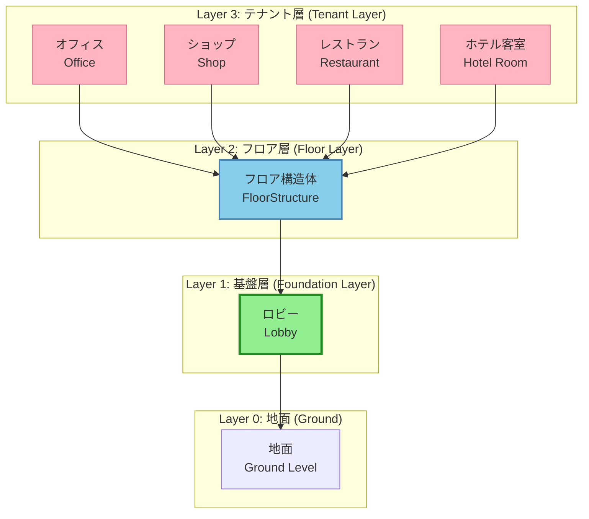
```mermaid
graph TB
    subgraph "Layer 3: テナント層 (Tenant Layer)"
        T1[オフィス<br/>Office]
        T2[ショップ<br/>Shop]
        T3[レストラン<br/>Restaurant]
        T4[ホテル客室<br/>Hotel Room]
    end

    subgraph "Layer 2: フロア層 (Floor Layer)"
        F1[フロア構造体<br/>FloorStructure]
    end

    subgraph "Layer 1: 基盤層 (Foundation Layer)"
        L1[ロビー<br/>Lobby]
    end

    subgraph "Layer 0: 地面 (Ground)"
        G[地面<br/>Ground Level]
    end

    T1 --> F1
    T2 --> F1
    T3 --> F1
    T4 --> F1
    F1 --> L1
    L1 --> G

    style L1 fill:#90EE90,stroke:#228B22,stroke-width:3px
    style F1 fill:#87CEEB,stroke:#4682B4,stroke-width:2px
    style T1 fill:#FFB6C1,stroke:#DB7093
    style T2 fill:#FFB6C1,stroke:#DB7093
    style T3 fill:#FFB6C1,stroke:#DB7093
    style T4 fill:#FFB6C1,stroke:#DB7093
```

### 2.2 配置依存関係

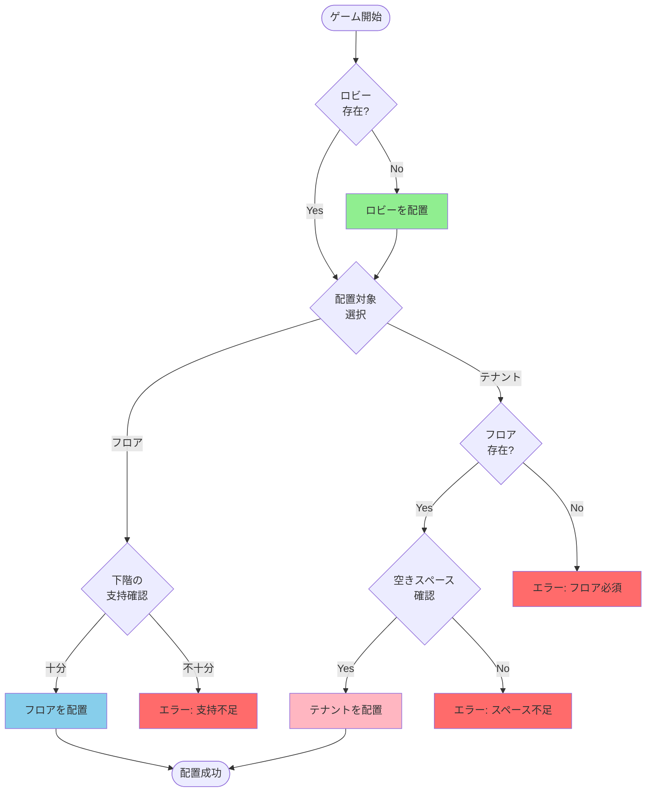
```mermaid
flowchart TD
    START([ゲーム開始]) --> CHECK_LOBBY{ロビー<br/>存在?}
    CHECK_LOBBY -->|No| PLACE_LOBBY[ロビーを配置]
    CHECK_LOBBY -->|Yes| CHOOSE{配置対象<br/>選択}
    PLACE_LOBBY --> CHOOSE

    CHOOSE -->|フロア| CHECK_FLOOR_SUPPORT{下階の<br/>支持確認}
    CHECK_FLOOR_SUPPORT -->|十分| PLACE_FLOOR[フロアを配置]
    CHECK_FLOOR_SUPPORT -->|不十分| ERROR_SUPPORT[エラー: 支持不足]

    CHOOSE -->|テナント| CHECK_TENANT_FLOOR{フロア<br/>存在?}
    CHECK_TENANT_FLOOR -->|Yes| CHECK_TENANT_SPACE{空きスペース<br/>確認}
    CHECK_TENANT_FLOOR -->|No| ERROR_FLOOR[エラー: フロア必須]
    CHECK_TENANT_SPACE -->|Yes| PLACE_TENANT[テナントを配置]
    CHECK_TENANT_SPACE -->|No| ERROR_SPACE[エラー: スペース不足]

    PLACE_FLOOR --> SUCCESS([配置成功])
    PLACE_TENANT --> SUCCESS

    style PLACE_LOBBY fill:#90EE90
    style PLACE_FLOOR fill:#87CEEB
    style PLACE_TENANT fill:#FFB6C1
    style ERROR_SUPPORT fill:#FF6B6B
    style ERROR_FLOOR fill:#FF6B6B
    style ERROR_SPACE fill:#FF6B6B
```

### 2.3 階層別機能マトリクス

| 階層 | 配置可能フロア | 依存関係 | 収益 | 従業員アクセス |
|------|---------------|----------|------|---------------|
| **ロビー** | 1F のみ | なし（必須） | なし | 入口として必須 |
| **フロア** | 2F 以上 | ロビー + 下階支持 | なし | 通路提供 |
| **テナント** | フロア上 | フロア存在 | あり | 目的地 |

---

## 3. コア概念とルール

### 3.1 The Tower II 基本ルール

#### 3.1.1 ロビー先行ルール (Lobby First Rule)

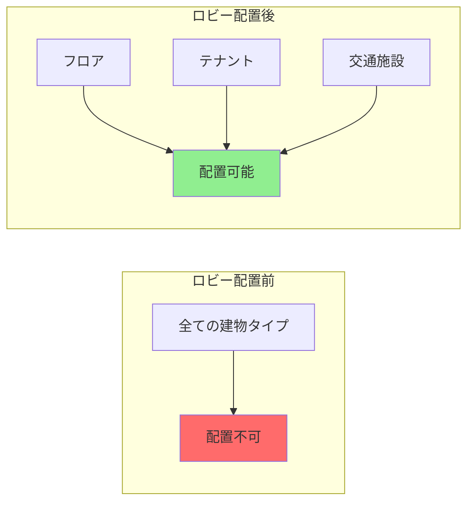
```mermaid
graph LR
    subgraph "ロビー配置前"
        A[配置不可]
        B[全ての建物タイプ]
        B --> A
    end

    subgraph "ロビー配置後"
        C[配置可能]
        D[フロア]
        E[テナント]
        F[交通施設]
        D --> C
        E --> C
        F --> C
    end

    style A fill:#FF6B6B
    style C fill:#90EE90
```

**実装ルール:**
- ゲーム開始時、ロビー以外の建物は配置不可
- ロビーは1F（地上階）にのみ配置可能
- 1つのタワーにつきロビーは1つのみ

#### 3.1.2 フロア依存ルール (Floor Dependency Rule)

```
テナント配置条件:
┌──────────────────────────────────────────────────────────┐
│  if (targetFloor == 1F) {                                │
│      ERROR: "ロビー階にテナント配置不可"                   │
│  }                                                        │
│  if (!FloorExistsAt(targetFloor)) {                      │
│      ERROR: "フロア構造体が必要"                          │
│  }                                                        │
│  if (!HasAvailableSpace(targetFloor, tenantWidth)) {     │
│      ERROR: "空きスペース不足"                            │
│  }                                                        │
│  ALLOW: テナント配置可能                                  │
└──────────────────────────────────────────────────────────┘
```

#### 3.1.3 オーバーハング禁止ルール (No Overhang Rule)

```
幅制限の視覚化:

  許可される配置:              禁止される配置:
  ┌─────────────┐            ┌─────────────────────┐
  │    3F (7)   │            │         3F (15)     │ ← 下階を超過
  ├─────────────┤            ├─────────────────────┤
  │    2F (9)   │            │    2F (9)   │
  ├─────────────┴───┐        ├─────────────┘
  │      1F (12)    │        │      1F (12)    │
  └─────────────────┘        └─────────────────┘

  MaxWidth(N階) ≤ MaxWidth(N-1階)
```

#### 3.1.4 ロビー階制限ルール (Lobby Floor Restriction)

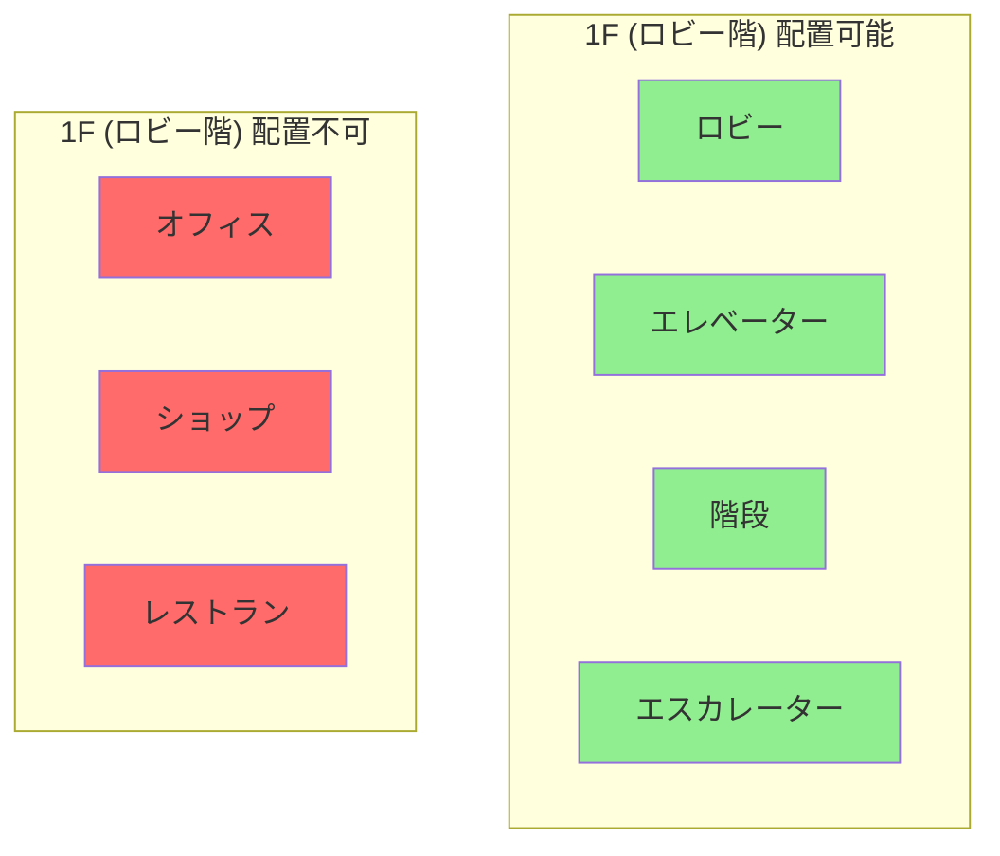
```mermaid
graph TB
    subgraph "1F (ロビー階) 配置可能"
        L[ロビー]
        EV[エレベーター]
        ST[階段]
        ES[エスカレーター]
    end

    subgraph "1F (ロビー階) 配置不可"
        OF[オフィス]
        SH[ショップ]
        RE[レストラン]
    end

    style L fill:#90EE90
    style EV fill:#90EE90
    style ST fill:#90EE90
    style ES fill:#90EE90
    style OF fill:#FF6B6B
    style SH fill:#FF6B6B
    style RE fill:#FF6B6B
```

### 3.2 配置バリデーション疑似コード

```csharp
PlacementResult ValidatePlacement(BuildingType type, GridPosition position)
{
    // ルール1: ロビー検証
    if (type == BuildingType.Lobby)
    {
        if (position.Floor != LOBBY_FLOOR)
            return Error("ロビーは1Fにのみ配置可能");
        if (LobbyExistsInTower(GetTowerId(position)))
            return Error("ロビーは1つのタワーにつき1つまで");
        return Success();
    }

    // ルール2: ロビー存在確認
    if (!LobbyExistsInTower(GetTowerId(position)))
        return Error("先にロビーを配置してください");

    // ルール3: フロア配置検証
    if (type == BuildingType.Floor)
    {
        if (position.Floor == LOBBY_FLOOR)
            return Error("1Fにはロビーを使用してください");
        if (!HasSupportBelow(position))
            return Error("下階の支持構造が不足しています");
        if (ExceedsWidthBelow(position))
            return Error("下階の幅を超えることはできません");
        return Success();
    }

    // ルール4: テナント配置検証
    if (IsTenantType(type))
    {
        if (position.Floor == LOBBY_FLOOR)
            return Error("ロビー階にテナントは配置できません");
        if (!FloorExistsAt(position.Floor))
            return Error("フロア構造体が必要です");
        if (!HasAvailableSpaceOnFloor(position))
            return Error("フロア上のスペースが不足しています");
        return Success();
    }

    return Error("不明な建物タイプ");
}
```

---

## 4. クラス設計

### 4.1 クラス図

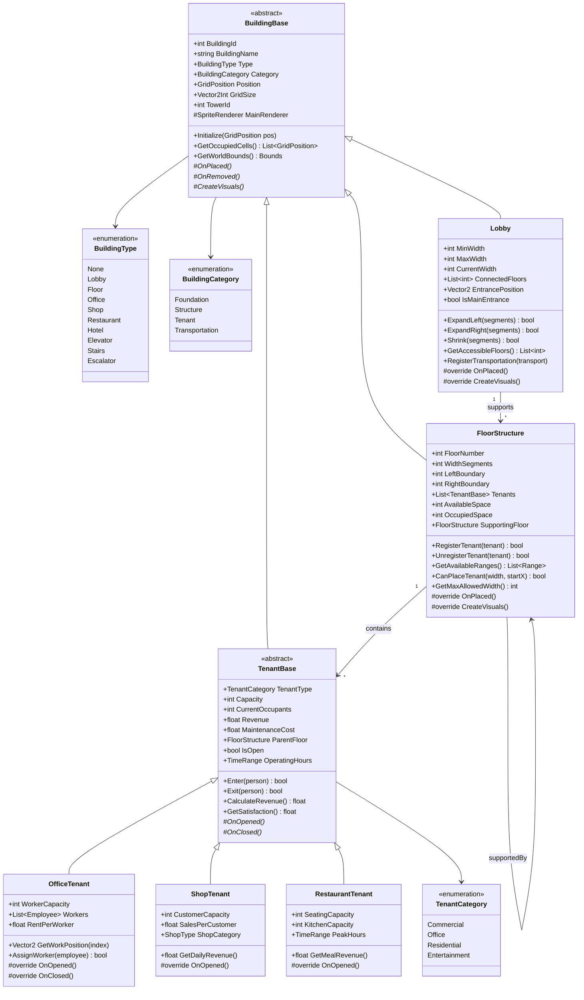
```mermaid
classDiagram
    %% 列挙型
    class BuildingType {
        <<enumeration>>
        None
        Lobby
        Floor
        Office
        Shop
        Restaurant
        Hotel
        Elevator
        Stairs
        Escalator
    }

    class BuildingCategory {
        <<enumeration>>
        Foundation
        Structure
        Tenant
        Transportation
    }

    class TenantCategory {
        <<enumeration>>
        Commercial
        Office
        Residential
        Entertainment
    }

    %% 基底クラス
    class BuildingBase {
        <<abstract>>
        +int BuildingId
        +string BuildingName
        +BuildingType Type
        +BuildingCategory Category
        +GridPosition Position
        +Vector2Int GridSize
        +int TowerId
        #SpriteRenderer MainRenderer
        +Initialize(GridPosition pos)
        +GetOccupiedCells() List~GridPosition~
        +GetWorldBounds() Bounds
        #OnPlaced()*
        #OnRemoved()*
        #CreateVisuals()*
    }

    %% ロビークラス
    class Lobby {
        +int MinWidth
        +int MaxWidth
        +int CurrentWidth
        +List~int~ ConnectedFloors
        +Vector2 EntrancePosition
        +bool IsMainEntrance
        +ExpandLeft(segments) bool
        +ExpandRight(segments) bool
        +Shrink(segments) bool
        +GetAccessibleFloors() List~int~
        +RegisterTransportation(transport)
        #override OnPlaced()
        #override CreateVisuals()
    }

    %% フロア構造体クラス
    class FloorStructure {
        +int FloorNumber
        +int WidthSegments
        +int LeftBoundary
        +int RightBoundary
        +List~TenantBase~ Tenants
        +int AvailableSpace
        +int OccupiedSpace
        +FloorStructure SupportingFloor
        +RegisterTenant(tenant) bool
        +UnregisterTenant(tenant) bool
        +GetAvailableRanges() List~Range~
        +CanPlaceTenant(width, startX) bool
        +GetMaxAllowedWidth() int
        #override OnPlaced()
        #override CreateVisuals()
    }

    %% テナント基底クラス
    class TenantBase {
        <<abstract>>
        +TenantCategory TenantType
        +int Capacity
        +int CurrentOccupants
        +float Revenue
        +float MaintenanceCost
        +FloorStructure ParentFloor
        +bool IsOpen
        +TimeRange OperatingHours
        +Enter(person) bool
        +Exit(person) bool
        +CalculateRevenue() float
        +GetSatisfaction() float
        #OnOpened()*
        #OnClosed()*
    }

    %% 具体的なテナントクラス
    class OfficeTenant {
        +int WorkerCapacity
        +List~Employee~ Workers
        +float RentPerWorker
        +Vector2 GetWorkPosition(index)
        +AssignWorker(employee) bool
        #override OnOpened()
        #override OnClosed()
    }

    class ShopTenant {
        +int CustomerCapacity
        +float SalesPerCustomer
        +ShopType ShopCategory
        +float GetDailyRevenue()
        #override OnOpened()
    }

    class RestaurantTenant {
        +int SeatingCapacity
        +int KitchenCapacity
        +TimeRange PeakHours
        +float GetMealRevenue()
        #override OnOpened()
    }

    %% 継承関係
    BuildingBase <|-- Lobby
    BuildingBase <|-- FloorStructure
    BuildingBase <|-- TenantBase
    TenantBase <|-- OfficeTenant
    TenantBase <|-- ShopTenant
    TenantBase <|-- RestaurantTenant

    %% 関連
    BuildingBase --> BuildingType
    BuildingBase --> BuildingCategory
    TenantBase --> TenantCategory
    FloorStructure "1" --> "*" TenantBase : contains
    Lobby "1" --> "*" FloorStructure : supports
    FloorStructure --> FloorStructure : supportedBy
```

### 4.2 マネージャークラス図

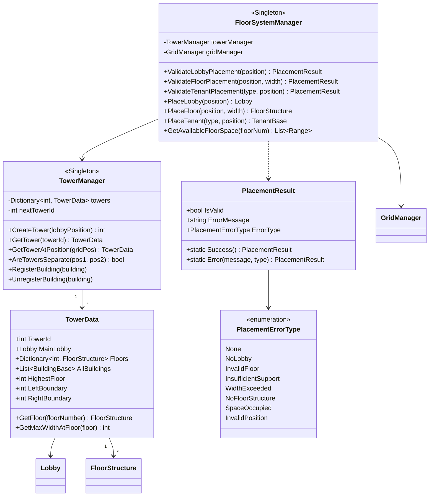
```mermaid
classDiagram
    class TowerManager {
        <<Singleton>>
        -Dictionary~int, TowerData~ towers
        -int nextTowerId
        +CreateTower(lobbyPosition) int
        +GetTower(towerId) TowerData
        +GetTowerAtPosition(gridPos) TowerData
        +AreTowersSeparate(pos1, pos2) bool
        +RegisterBuilding(building)
        +UnregisterBuilding(building)
    }

    class TowerData {
        +int TowerId
        +Lobby MainLobby
        +Dictionary~int, FloorStructure~ Floors
        +List~BuildingBase~ AllBuildings
        +int HighestFloor
        +int LeftBoundary
        +int RightBoundary
        +GetFloor(floorNumber) FloorStructure
        +GetMaxWidthAtFloor(floor) int
    }

    class FloorSystemManager {
        <<Singleton>>
        -TowerManager towerManager
        -GridManager gridManager
        +ValidateLobbyPlacement(position) PlacementResult
        +ValidateFloorPlacement(position, width) PlacementResult
        +ValidateTenantPlacement(type, position) PlacementResult
        +PlaceLobby(position) Lobby
        +PlaceFloor(position, width) FloorStructure
        +PlaceTenant(type, position) TenantBase
        +GetAvailableFloorSpace(floorNum) List~Range~
    }

    class PlacementResult {
        +bool IsValid
        +string ErrorMessage
        +PlacementErrorType ErrorType
        +static Success() PlacementResult
        +static Error(message, type) PlacementResult
    }

    class PlacementErrorType {
        <<enumeration>>
        None
        NoLobby
        InvalidFloor
        InsufficientSupport
        WidthExceeded
        NoFloorStructure
        SpaceOccupied
        InvalidPosition
    }

    TowerManager "1" --> "*" TowerData
    TowerData --> Lobby
    TowerData "1" --> "*" FloorStructure
    FloorSystemManager --> TowerManager
    FloorSystemManager --> GridManager
    FloorSystemManager ..> PlacementResult
    PlacementResult --> PlacementErrorType
```

### 4.3 BuildingType 拡張

```csharp
/// <summary>
/// 建物タイプの定義
/// The Tower II の階層システムに対応
/// </summary>
public enum BuildingType
{
    // === 基盤層 (Foundation) ===
    None = 0,

    /// <summary>ロビー - 1Fに配置、建物の基盤</summary>
    Lobby = 100,

    // === 構造層 (Structure) ===

    /// <summary>フロア構造体 - テナント配置用の空間</summary>
    Floor = 200,

    // === テナント層 (Tenant) ===

    /// <summary>オフィス - 従業員が勤務</summary>
    Office = 300,

    /// <summary>ショップ - 商業施設</summary>
    Shop = 301,

    /// <summary>レストラン - 飲食施設</summary>
    Restaurant = 302,

    /// <summary>ホテル客室 - 宿泊施設</summary>
    HotelRoom = 303,

    /// <summary>映画館 - 娯楽施設</summary>
    Cinema = 304,

    // === 交通施設層 (Transportation) ===

    /// <summary>エレベーター - 垂直移動</summary>
    Elevator = 400,

    /// <summary>階段 - 垂直移動（低コスト）</summary>
    Stairs = 401,

    /// <summary>エスカレーター - 垂直移動（隣接階のみ）</summary>
    Escalator = 402
}

/// <summary>
/// 建物カテゴリの定義
/// </summary>
public enum BuildingCategory
{
    /// <summary>基盤 - ロビー</summary>
    Foundation,

    /// <summary>構造 - フロア</summary>
    Structure,

    /// <summary>テナント - 収益施設</summary>
    Tenant,

    /// <summary>交通 - 移動施設</summary>
    Transportation
}
```

---

## 5. 配置フロー

### 5.1 ロビー配置シーケンス

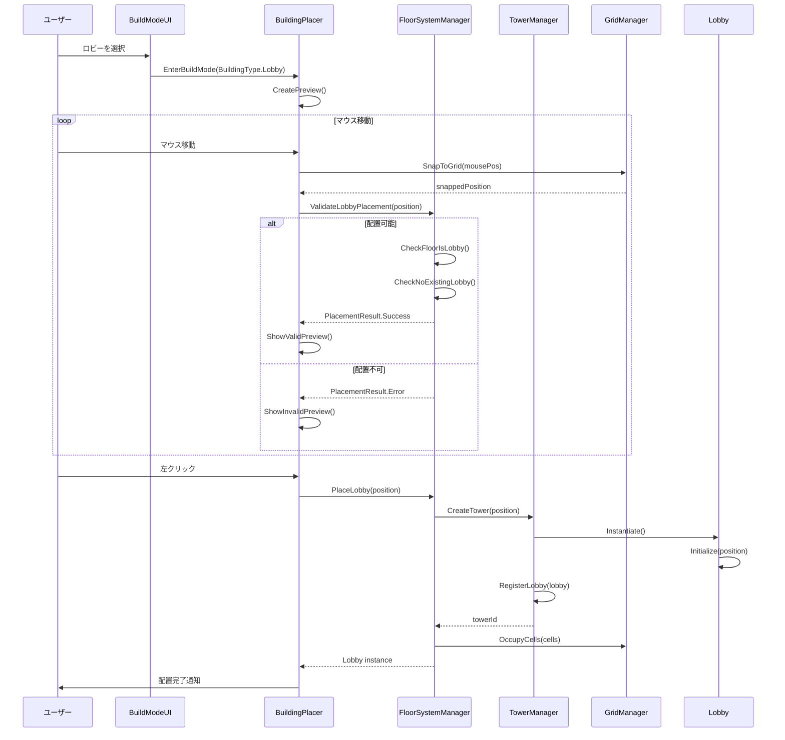
```mermaid
sequenceDiagram
    participant U as ユーザー
    participant UI as BuildModeUI
    participant BP as BuildingPlacer
    participant FSM as FloorSystemManager
    participant TM as TowerManager
    participant GM as GridManager
    participant L as Lobby

    U->>UI: ロビーを選択
    UI->>BP: EnterBuildMode(BuildingType.Lobby)
    BP->>BP: CreatePreview()

    loop マウス移動
        U->>BP: マウス移動
        BP->>GM: SnapToGrid(mousePos)
        GM-->>BP: snappedPosition
        BP->>FSM: ValidateLobbyPlacement(position)

        alt 配置可能
            FSM->>FSM: CheckFloorIsLobby()
            FSM->>FSM: CheckNoExistingLobby()
            FSM-->>BP: PlacementResult.Success
            BP->>BP: ShowValidPreview()
        else 配置不可
            FSM-->>BP: PlacementResult.Error
            BP->>BP: ShowInvalidPreview()
        end
    end

    U->>BP: 左クリック
    BP->>FSM: PlaceLobby(position)
    FSM->>TM: CreateTower(position)
    TM->>L: Instantiate()
    L->>L: Initialize(position)
    TM->>TM: RegisterLobby(lobby)
    TM-->>FSM: towerId
    FSM->>GM: OccupyCells(cells)
    FSM-->>BP: Lobby instance
    BP->>U: 配置完了通知
```

### 5.2 フロア配置シーケンス

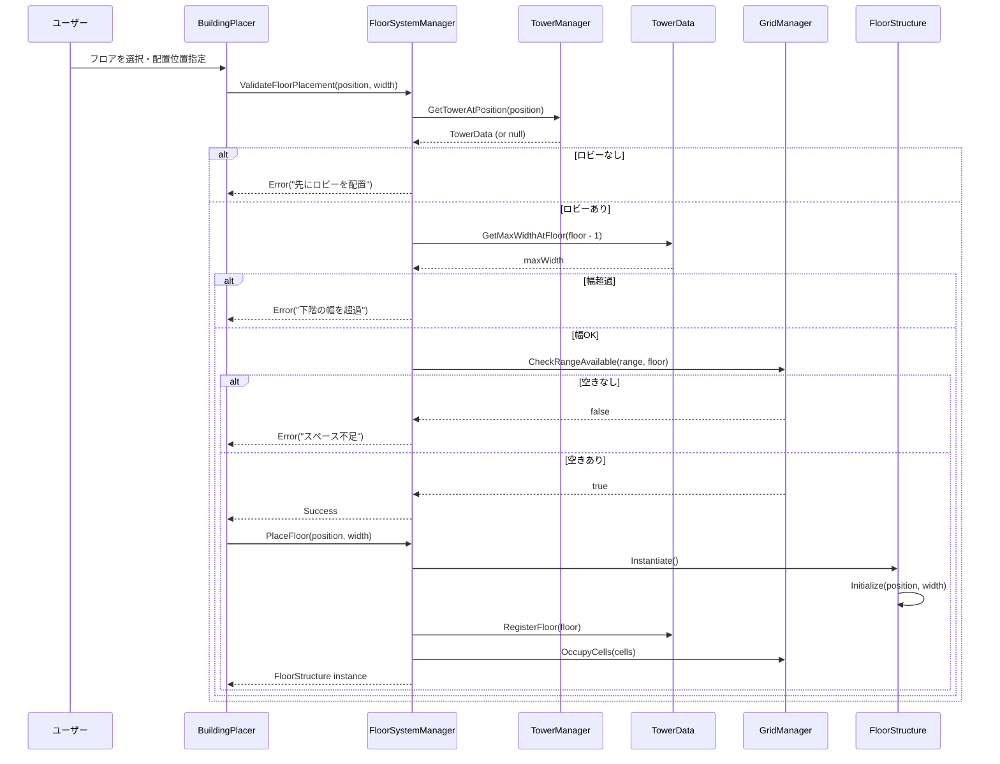
```mermaid
sequenceDiagram
    participant U as ユーザー
    participant BP as BuildingPlacer
    participant FSM as FloorSystemManager
    participant TM as TowerManager
    participant TD as TowerData
    participant GM as GridManager
    participant FS as FloorStructure

    U->>BP: フロアを選択・配置位置指定
    BP->>FSM: ValidateFloorPlacement(position, width)

    FSM->>TM: GetTowerAtPosition(position)
    TM-->>FSM: TowerData (or null)

    alt ロビーなし
        FSM-->>BP: Error("先にロビーを配置")
    else ロビーあり
        FSM->>TD: GetMaxWidthAtFloor(floor - 1)
        TD-->>FSM: maxWidth

        alt 幅超過
            FSM-->>BP: Error("下階の幅を超過")
        else 幅OK
            FSM->>GM: CheckRangeAvailable(range, floor)

            alt 空きなし
                GM-->>FSM: false
                FSM-->>BP: Error("スペース不足")
            else 空きあり
                GM-->>FSM: true
                FSM-->>BP: Success
                BP->>FSM: PlaceFloor(position, width)
                FSM->>FS: Instantiate()
                FS->>FS: Initialize(position, width)
                FSM->>TD: RegisterFloor(floor)
                FSM->>GM: OccupyCells(cells)
                FSM-->>BP: FloorStructure instance
            end
        end
    end
```

### 5.3 テナント配置シーケンス

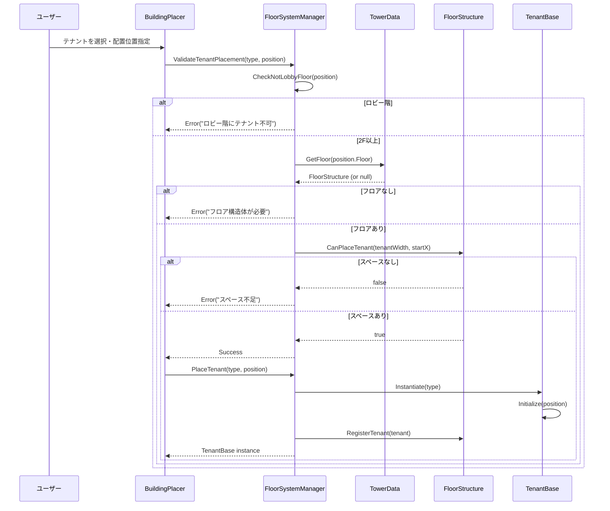
```mermaid
sequenceDiagram
    participant U as ユーザー
    participant BP as BuildingPlacer
    participant FSM as FloorSystemManager
    participant TD as TowerData
    participant FS as FloorStructure
    participant T as TenantBase

    U->>BP: テナントを選択・配置位置指定
    BP->>FSM: ValidateTenantPlacement(type, position)

    FSM->>FSM: CheckNotLobbyFloor(position)

    alt ロビー階
        FSM-->>BP: Error("ロビー階にテナント不可")
    else 2F以上
        FSM->>TD: GetFloor(position.Floor)
        TD-->>FSM: FloorStructure (or null)

        alt フロアなし
            FSM-->>BP: Error("フロア構造体が必要")
        else フロアあり
            FSM->>FS: CanPlaceTenant(tenantWidth, startX)

            alt スペースなし
                FS-->>FSM: false
                FSM-->>BP: Error("スペース不足")
            else スペースあり
                FS-->>FSM: true
                FSM-->>BP: Success
                BP->>FSM: PlaceTenant(type, position)
                FSM->>T: Instantiate(type)
                T->>T: Initialize(position)
                FSM->>FS: RegisterTenant(tenant)
                FSM-->>BP: TenantBase instance
            end
        end
    end
```

### 5.4 統合配置フロー図

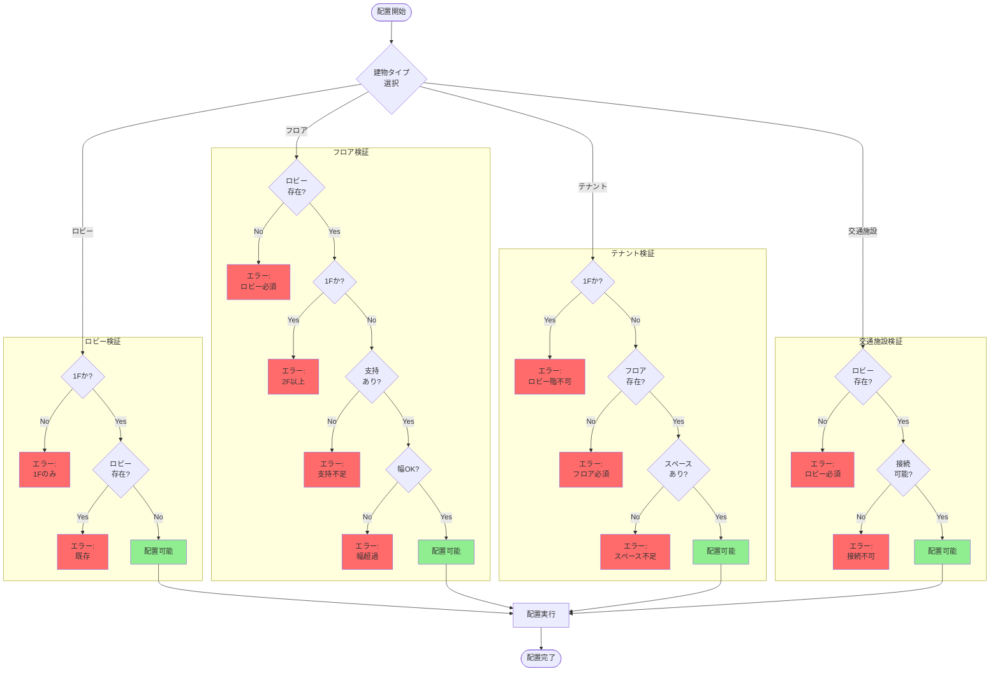
```mermaid
flowchart TD
    START([配置開始]) --> SELECT{建物タイプ<br/>選択}

    SELECT -->|ロビー| LOBBY_CHECK
    SELECT -->|フロア| FLOOR_CHECK
    SELECT -->|テナント| TENANT_CHECK
    SELECT -->|交通施設| TRANSPORT_CHECK

    subgraph "ロビー検証"
        LOBBY_CHECK{1Fか?}
        LOBBY_CHECK -->|No| LOBBY_ERR1[エラー:<br/>1Fのみ]
        LOBBY_CHECK -->|Yes| LOBBY_CHECK2{ロビー<br/>存在?}
        LOBBY_CHECK2 -->|Yes| LOBBY_ERR2[エラー:<br/>既存]
        LOBBY_CHECK2 -->|No| LOBBY_OK[配置可能]
    end

    subgraph "フロア検証"
        FLOOR_CHECK{ロビー<br/>存在?}
        FLOOR_CHECK -->|No| FLOOR_ERR1[エラー:<br/>ロビー必須]
        FLOOR_CHECK -->|Yes| FLOOR_CHECK2{1Fか?}
        FLOOR_CHECK2 -->|Yes| FLOOR_ERR2[エラー:<br/>2F以上]
        FLOOR_CHECK2 -->|No| FLOOR_CHECK3{支持<br/>あり?}
        FLOOR_CHECK3 -->|No| FLOOR_ERR3[エラー:<br/>支持不足]
        FLOOR_CHECK3 -->|Yes| FLOOR_CHECK4{幅OK?}
        FLOOR_CHECK4 -->|No| FLOOR_ERR4[エラー:<br/>幅超過]
        FLOOR_CHECK4 -->|Yes| FLOOR_OK[配置可能]
    end

    subgraph "テナント検証"
        TENANT_CHECK{1Fか?}
        TENANT_CHECK -->|Yes| TENANT_ERR1[エラー:<br/>ロビー階不可]
        TENANT_CHECK -->|No| TENANT_CHECK2{フロア<br/>存在?}
        TENANT_CHECK2 -->|No| TENANT_ERR2[エラー:<br/>フロア必須]
        TENANT_CHECK2 -->|Yes| TENANT_CHECK3{スペース<br/>あり?}
        TENANT_CHECK3 -->|No| TENANT_ERR3[エラー:<br/>スペース不足]
        TENANT_CHECK3 -->|Yes| TENANT_OK[配置可能]
    end

    subgraph "交通施設検証"
        TRANSPORT_CHECK{ロビー<br/>存在?}
        TRANSPORT_CHECK -->|No| TRANS_ERR1[エラー:<br/>ロビー必須]
        TRANSPORT_CHECK -->|Yes| TRANS_CHECK2{接続<br/>可能?}
        TRANS_CHECK2 -->|No| TRANS_ERR2[エラー:<br/>接続不可]
        TRANS_CHECK2 -->|Yes| TRANS_OK[配置可能]
    end

    LOBBY_OK --> PLACE[配置実行]
    FLOOR_OK --> PLACE
    TENANT_OK --> PLACE
    TRANS_OK --> PLACE

    PLACE --> END([配置完了])

    style LOBBY_OK fill:#90EE90
    style FLOOR_OK fill:#90EE90
    style TENANT_OK fill:#90EE90
    style TRANS_OK fill:#90EE90
    style LOBBY_ERR1 fill:#FF6B6B
    style LOBBY_ERR2 fill:#FF6B6B
    style FLOOR_ERR1 fill:#FF6B6B
    style FLOOR_ERR2 fill:#FF6B6B
    style FLOOR_ERR3 fill:#FF6B6B
    style FLOOR_ERR4 fill:#FF6B6B
    style TENANT_ERR1 fill:#FF6B6B
    style TENANT_ERR2 fill:#FF6B6B
    style TENANT_ERR3 fill:#FF6B6B
    style TRANS_ERR1 fill:#FF6B6B
    style TRANS_ERR2 fill:#FF6B6B
```

---

## 6. データ構造定義

### 6.1 Lobby クラス詳細

```csharp
using System;
using System.Collections.Generic;
using UnityEngine;

namespace TowerGame.Building
{
    /// <summary>
    /// ロビー - 建物の基盤となる1F構造
    /// The Tower II では全ての建物の起点となる必須構造
    /// </summary>
    public class Lobby : BuildingBase
    {
        #region Constants

        /// <summary>ロビーの最小幅（セグメント）</summary>
        public const int MIN_LOBBY_WIDTH = 3;

        /// <summary>ロビーの最大幅（セグメント）</summary>
        public const int MAX_LOBBY_WIDTH = 50;

        /// <summary>ロビーのデフォルト幅（セグメント）</summary>
        public const int DEFAULT_LOBBY_WIDTH = 9;

        #endregion

        #region Serialized Fields

        [Header("ロビー設定")]
        [SerializeField] private int initialWidth = DEFAULT_LOBBY_WIDTH;
        [SerializeField] private Transform entrancePoint;
        [SerializeField] private Transform leftExpansionPoint;
        [SerializeField] private Transform rightExpansionPoint;

        #endregion

        #region Properties

        /// <summary>現在の幅（セグメント）</summary>
        public int CurrentWidth { get; private set; }

        /// <summary>左端のセグメント位置</summary>
        public int LeftBoundary { get; private set; }

        /// <summary>右端のセグメント位置</summary>
        public int RightBoundary { get; private set; }

        /// <summary>エントランスのワールド座標</summary>
        public Vector2 EntrancePosition => entrancePoint != null
            ? (Vector2)entrancePoint.position
            : (Vector2)transform.position;

        /// <summary>このロビーに接続されたフロア番号リスト</summary>
        public List<int> ConnectedFloors { get; } = new List<int>();

        /// <summary>登録されている交通施設</summary>
        public List<BuildingBase> TransportationFacilities { get; } = new List<BuildingBase>();

        /// <summary>メインエントランスかどうか</summary>
        public bool IsMainEntrance { get; set; } = true;

        #endregion

        #region Initialization

        public override void Initialize(GridPosition position)
        {
            base.Initialize(position);

            Type = BuildingType.Lobby;
            Category = BuildingCategory.Foundation;

            CurrentWidth = initialWidth;
            CalculateBoundaries();
        }

        private void CalculateBoundaries()
        {
            int halfWidth = CurrentWidth / 2;
            LeftBoundary = Position.X - halfWidth;
            RightBoundary = Position.X + halfWidth;

            // 偶数幅の場合の調整
            if (CurrentWidth % 2 == 0)
            {
                RightBoundary--;
            }

            GridSize = new Vector2Int(CurrentWidth, 1);
        }

        #endregion

        #region Expansion Methods

        /// <summary>
        /// ロビーを左方向に拡張
        /// </summary>
        /// <param name="segments">拡張するセグメント数</param>
        /// <returns>拡張に成功した場合true</returns>
        public bool ExpandLeft(int segments)
        {
            if (segments <= 0) return false;
            if (CurrentWidth + segments > MAX_LOBBY_WIDTH) return false;

            // グリッドの空き確認
            int newLeftBoundary = LeftBoundary - segments;
            if (!CanExpandTo(newLeftBoundary, LeftBoundary - 1))
                return false;

            LeftBoundary = newLeftBoundary;
            CurrentWidth += segments;
            UpdateVisuals();

            OnExpanded?.Invoke(this);
            return true;
        }

        /// <summary>
        /// ロビーを右方向に拡張
        /// </summary>
        public bool ExpandRight(int segments)
        {
            if (segments <= 0) return false;
            if (CurrentWidth + segments > MAX_LOBBY_WIDTH) return false;

            int newRightBoundary = RightBoundary + segments;
            if (!CanExpandTo(RightBoundary + 1, newRightBoundary))
                return false;

            RightBoundary = newRightBoundary;
            CurrentWidth += segments;
            UpdateVisuals();

            OnExpanded?.Invoke(this);
            return true;
        }

        private bool CanExpandTo(int startX, int endX)
        {
            for (int x = startX; x <= endX; x++)
            {
                var checkPos = new GridPosition(x, Position.Floor);
                if (GridManager.Instance.IsCellOccupied(checkPos))
                    return false;
            }
            return true;
        }

        #endregion

        #region Floor Connection

        /// <summary>
        /// フロアをこのロビーに登録
        /// </summary>
        public void RegisterFloor(int floorNumber)
        {
            if (!ConnectedFloors.Contains(floorNumber))
            {
                ConnectedFloors.Add(floorNumber);
                ConnectedFloors.Sort();
            }
        }

        /// <summary>
        /// 交通施設を登録
        /// </summary>
        public void RegisterTransportation(BuildingBase transport)
        {
            if (!TransportationFacilities.Contains(transport))
            {
                TransportationFacilities.Add(transport);
            }
        }

        /// <summary>
        /// アクセス可能なフロア番号を取得
        /// </summary>
        public List<int> GetAccessibleFloors()
        {
            // エレベーターや階段でアクセス可能なフロアを計算
            var accessible = new List<int> { Position.Floor };

            foreach (var transport in TransportationFacilities)
            {
                // 各交通施設がカバーするフロアを追加
                // (エレベーター実装後に詳細化)
            }

            return accessible;
        }

        #endregion

        #region Events

        /// <summary>ロビーが拡張された時</summary>
        public event Action<Lobby> OnExpanded;

        #endregion

        #region Overrides

        public override List<GridPosition> GetOccupiedCells()
        {
            var cells = new List<GridPosition>();
            for (int x = LeftBoundary; x <= RightBoundary; x++)
            {
                cells.Add(new GridPosition(x, Position.Floor));
            }
            return cells;
        }

        protected override void OnPlaced()
        {
            // エントランスポイントの設定
            CreateEntrancePoint();
        }

        protected override void CreateVisuals()
        {
            // ロビーのビジュアル生成（床、柱、入口など）
            UpdateVisuals();
        }

        private void UpdateVisuals()
        {
            // 幅に応じてビジュアルを更新
            if (MainRenderer != null)
            {
                var worldSize = GridManager.Instance.Config.GetWorldSize(GridSize);
                MainRenderer.size = worldSize;
            }
        }

        private void CreateEntrancePoint()
        {
            if (entrancePoint == null)
            {
                var entranceObj = new GameObject("EntrancePoint");
                entranceObj.transform.SetParent(transform);
                entranceObj.transform.localPosition = new Vector3(0, -0.5f, 0);
                entrancePoint = entranceObj.transform;
            }
        }

        #endregion
    }
}
```

### 6.2 FloorStructure クラス詳細

```csharp
using System;
using System.Collections.Generic;
using UnityEngine;

namespace TowerGame.Building
{
    /// <summary>
    /// フロア構造体 - テナントを配置するための空間
    /// 2F以上に配置され、テナント配置の基盤となる
    /// </summary>
    public class FloorStructure : BuildingBase
    {
        #region Constants

        /// <summary>支持に必要な下階カバー率</summary>
        public const float REQUIRED_SUPPORT_RATIO = 0.7f;

        #endregion

        #region Serialized Fields

        [Header("フロア設定")]
        [SerializeField] private int widthSegments = 9;
        [SerializeField] private Color floorColor = new Color(0.8f, 0.8f, 0.8f);
        [SerializeField] private bool showGridLines = true;

        #endregion

        #region Properties

        /// <summary>フロア番号</summary>
        public int FloorNumber { get; private set; }

        /// <summary>幅（セグメント）</summary>
        public int WidthSegments => widthSegments;

        /// <summary>左端のセグメント位置</summary>
        public int LeftBoundary { get; private set; }

        /// <summary>右端のセグメント位置</summary>
        public int RightBoundary { get; private set; }

        /// <summary>配置されているテナント</summary>
        public List<TenantBase> Tenants { get; } = new List<TenantBase>();

        /// <summary>利用可能なスペース（セグメント）</summary>
        public int AvailableSpace => widthSegments - OccupiedSpace;

        /// <summary>使用中のスペース（セグメント）</summary>
        public int OccupiedSpace { get; private set; }

        /// <summary>このフロアを支えている下階のフロア</summary>
        public FloorStructure SupportingFloor { get; set; }

        /// <summary>テナント占有マップ（セグメント位置 → テナント）</summary>
        private Dictionary<int, TenantBase> _occupancyMap = new Dictionary<int, TenantBase>();

        #endregion

        #region Initialization

        public override void Initialize(GridPosition position)
        {
            base.Initialize(position);

            Type = BuildingType.Floor;
            Category = BuildingCategory.Structure;
            FloorNumber = position.Floor;

            CalculateBoundaries();
        }

        /// <summary>
        /// 幅を指定して初期化
        /// </summary>
        public void Initialize(GridPosition position, int width)
        {
            widthSegments = width;
            Initialize(position);
        }

        private void CalculateBoundaries()
        {
            int halfWidth = widthSegments / 2;
            LeftBoundary = Position.X - halfWidth;
            RightBoundary = Position.X + halfWidth;

            if (widthSegments % 2 == 0)
            {
                RightBoundary--;
            }

            GridSize = new Vector2Int(widthSegments, 1);
        }

        #endregion

        #region Tenant Management

        /// <summary>
        /// テナントを登録
        /// </summary>
        /// <param name="tenant">登録するテナント</param>
        /// <returns>登録成功時true</returns>
        public bool RegisterTenant(TenantBase tenant)
        {
            if (tenant == null) return false;

            var tenantCells = tenant.GetOccupiedCells();

            // 空き確認
            foreach (var cell in tenantCells)
            {
                if (_occupancyMap.ContainsKey(cell.X))
                    return false;
            }

            // 登録
            foreach (var cell in tenantCells)
            {
                _occupancyMap[cell.X] = tenant;
            }

            Tenants.Add(tenant);
            OccupiedSpace += tenant.GridSize.x;
            tenant.ParentFloor = this;

            OnTenantRegistered?.Invoke(tenant);
            return true;
        }

        /// <summary>
        /// テナントを登録解除
        /// </summary>
        public bool UnregisterTenant(TenantBase tenant)
        {
            if (!Tenants.Contains(tenant)) return false;

            var tenantCells = tenant.GetOccupiedCells();
            foreach (var cell in tenantCells)
            {
                _occupancyMap.Remove(cell.X);
            }

            Tenants.Remove(tenant);
            OccupiedSpace -= tenant.GridSize.x;
            tenant.ParentFloor = null;

            OnTenantUnregistered?.Invoke(tenant);
            return true;
        }

        /// <summary>
        /// 指定位置にテナントを配置可能か確認
        /// </summary>
        /// <param name="width">テナントの幅（セグメント）</param>
        /// <param name="startX">開始X位置</param>
        public bool CanPlaceTenant(int width, int startX)
        {
            // 範囲チェック
            if (startX < LeftBoundary) return false;
            if (startX + width - 1 > RightBoundary) return false;

            // 占有チェック
            for (int x = startX; x < startX + width; x++)
            {
                if (_occupancyMap.ContainsKey(x))
                    return false;
            }

            return true;
        }

        /// <summary>
        /// 利用可能な範囲のリストを取得
        /// </summary>
        public List<Range> GetAvailableRanges()
        {
            var ranges = new List<Range>();
            int rangeStart = -1;

            for (int x = LeftBoundary; x <= RightBoundary; x++)
            {
                bool isOccupied = _occupancyMap.ContainsKey(x);

                if (!isOccupied && rangeStart < 0)
                {
                    rangeStart = x;
                }
                else if (isOccupied && rangeStart >= 0)
                {
                    ranges.Add(new Range { Start = rangeStart, End = x - 1 });
                    rangeStart = -1;
                }
            }

            if (rangeStart >= 0)
            {
                ranges.Add(new Range { Start = rangeStart, End = RightBoundary });
            }

            return ranges;
        }

        /// <summary>
        /// 下階の支持を確認
        /// </summary>
        public static bool HasSufficientSupport(GridPosition position, int width, float requiredRatio = REQUIRED_SUPPORT_RATIO)
        {
            int halfWidth = width / 2;
            int startX = position.X - halfWidth;
            int endX = position.X + halfWidth - (width % 2 == 0 ? 1 : 0);

            int supportedSegments = 0;

            for (int x = startX; x <= endX; x++)
            {
                var belowPos = new GridPosition(x, position.Floor - 1);
                if (GridManager.Instance.IsCellOccupied(belowPos))
                {
                    supportedSegments++;
                }
            }

            float ratio = (float)supportedSegments / width;
            return ratio >= requiredRatio;
        }

        /// <summary>
        /// 下階から許可される最大幅を取得
        /// </summary>
        public int GetMaxAllowedWidth()
        {
            if (SupportingFloor != null)
            {
                return SupportingFloor.WidthSegments;
            }

            // ロビーを探す
            var tower = TowerManager.Instance.GetTowerAtPosition(Position);
            if (tower?.MainLobby != null)
            {
                return tower.MainLobby.CurrentWidth;
            }

            return 0;
        }

        #endregion

        #region Events

        /// <summary>テナントが登録された時</summary>
        public event Action<TenantBase> OnTenantRegistered;

        /// <summary>テナントが登録解除された時</summary>
        public event Action<TenantBase> OnTenantUnregistered;

        #endregion

        #region Overrides

        public override List<GridPosition> GetOccupiedCells()
        {
            var cells = new List<GridPosition>();
            for (int x = LeftBoundary; x <= RightBoundary; x++)
            {
                cells.Add(new GridPosition(x, FloorNumber));
            }
            return cells;
        }

        protected override void OnPlaced()
        {
            // フロアラインの描画など
        }

        protected override void CreateVisuals()
        {
            // フロアのビジュアル（床、グリッドラインなど）
            if (showGridLines)
            {
                CreateGridLines();
            }
        }

        private void CreateGridLines()
        {
            // セグメント区切り線を描画（エディタ/デバッグ用）
        }

        #endregion
    }

    /// <summary>
    /// 範囲を表す構造体
    /// </summary>
    [System.Serializable]
    public struct Range
    {
        public int Start;
        public int End;

        public int Width => End - Start + 1;

        public bool Contains(int value) => value >= Start && value <= End;

        public bool Overlaps(Range other)
        {
            return Start <= other.End && End >= other.Start;
        }
    }
}
```

### 6.3 TenantBase 抽象クラス

```csharp
using System;
using System.Collections.Generic;
using UnityEngine;

namespace TowerGame.Building
{
    /// <summary>
    /// テナントの基底クラス
    /// オフィス、ショップ、レストランなど収益施設の共通機能
    /// </summary>
    public abstract class TenantBase : BuildingBase
    {
        #region Serialized Fields

        [Header("テナント基本設定")]
        [SerializeField] protected int capacity = 10;
        [SerializeField] protected float rentPerDay = 100f;
        [SerializeField] protected float maintenanceCostPerDay = 20f;

        [Header("営業時間")]
        [SerializeField] protected int openingHour = 8;
        [SerializeField] protected int closingHour = 18;

        #endregion

        #region Properties

        /// <summary>テナントカテゴリ</summary>
        public TenantCategory TenantType { get; protected set; }

        /// <summary>最大収容人数</summary>
        public int Capacity => capacity;

        /// <summary>現在の入居者/利用者数</summary>
        public int CurrentOccupants { get; protected set; }

        /// <summary>空き容量</summary>
        public int AvailableCapacity => capacity - CurrentOccupants;

        /// <summary>満員かどうか</summary>
        public bool IsFull => CurrentOccupants >= capacity;

        /// <summary>1日あたりの賃料</summary>
        public float RentPerDay => rentPerDay;

        /// <summary>1日あたりの維持費</summary>
        public float MaintenanceCostPerDay => maintenanceCostPerDay;

        /// <summary>親フロア構造体</summary>
        public FloorStructure ParentFloor { get; set; }

        /// <summary>営業中かどうか</summary>
        public bool IsOpen { get; protected set; }

        /// <summary>営業時間</summary>
        public TimeRange OperatingHours => new TimeRange(openingHour, closingHour);

        /// <summary>入居者/利用者リスト</summary>
        protected List<GameObject> occupants = new List<GameObject>();

        #endregion

        #region Unity Lifecycle

        protected virtual void Start()
        {
            Category = BuildingCategory.Tenant;

            // 時間イベント購読
            if (GameTimeManager.Instance != null)
            {
                GameTimeManager.Instance.OnHourChanged += OnHourChanged;
            }
        }

        protected virtual void OnDestroy()
        {
            if (GameTimeManager.Instance != null)
            {
                GameTimeManager.Instance.OnHourChanged -= OnHourChanged;
            }
        }

        #endregion

        #region Time Management

        private void OnHourChanged(int hour)
        {
            bool shouldBeOpen = hour >= openingHour && hour < closingHour;

            if (shouldBeOpen && !IsOpen)
            {
                Open();
            }
            else if (!shouldBeOpen && IsOpen)
            {
                Close();
            }
        }

        protected virtual void Open()
        {
            IsOpen = true;
            OnOpened();
        }

        protected virtual void Close()
        {
            IsOpen = false;
            OnClosed();
        }

        #endregion

        #region Occupant Management

        /// <summary>
        /// 入室処理
        /// </summary>
        /// <param name="person">入室する人物</param>
        /// <returns>入室成功時true</returns>
        public virtual bool Enter(GameObject person)
        {
            if (!IsOpen) return false;
            if (IsFull) return false;
            if (occupants.Contains(person)) return false;

            occupants.Add(person);
            CurrentOccupants++;

            OnPersonEntered?.Invoke(person);
            return true;
        }

        /// <summary>
        /// 退室処理
        /// </summary>
        public virtual bool Exit(GameObject person)
        {
            if (!occupants.Contains(person)) return false;

            occupants.Remove(person);
            CurrentOccupants--;

            OnPersonExited?.Invoke(person);
            return true;
        }

        /// <summary>
        /// 全員退室
        /// </summary>
        public virtual void EvacuateAll()
        {
            var toEvacuate = new List<GameObject>(occupants);
            foreach (var person in toEvacuate)
            {
                Exit(person);
            }
        }

        #endregion

        #region Revenue Calculation

        /// <summary>
        /// 日次収益を計算
        /// </summary>
        public virtual float CalculateDailyRevenue()
        {
            return rentPerDay - maintenanceCostPerDay;
        }

        /// <summary>
        /// 満足度を取得（0-1）
        /// </summary>
        public virtual float GetSatisfaction()
        {
            // 基本実装：容量に対する使用率
            if (capacity <= 0) return 1f;
            return Mathf.Clamp01((float)CurrentOccupants / capacity);
        }

        #endregion

        #region Events

        /// <summary>人物が入室した時</summary>
        public event Action<GameObject> OnPersonEntered;

        /// <summary>人物が退室した時</summary>
        public event Action<GameObject> OnPersonExited;

        #endregion

        #region Abstract Methods

        /// <summary>
        /// 営業開始時の処理
        /// </summary>
        protected abstract void OnOpened();

        /// <summary>
        /// 営業終了時の処理
        /// </summary>
        protected abstract void OnClosed();

        #endregion
    }

    /// <summary>
    /// テナントカテゴリ
    /// </summary>
    public enum TenantCategory
    {
        /// <summary>商業施設（ショップ）</summary>
        Commercial,

        /// <summary>オフィス</summary>
        Office,

        /// <summary>住居（ホテル、マンション）</summary>
        Residential,

        /// <summary>娯楽施設（映画館など）</summary>
        Entertainment,

        /// <summary>飲食施設</summary>
        Food
    }

    /// <summary>
    /// 時間範囲
    /// </summary>
    [System.Serializable]
    public struct TimeRange
    {
        public int StartHour;
        public int EndHour;

        public TimeRange(int start, int end)
        {
            StartHour = start;
            EndHour = end;
        }

        public bool Contains(int hour)
        {
            if (StartHour <= EndHour)
            {
                return hour >= StartHour && hour < EndHour;
            }
            // 深夜をまたぐ場合
            return hour >= StartHour || hour < EndHour;
        }
    }
}
```

---

## 7. グリッド統合

### 7.1 GridManager との連携

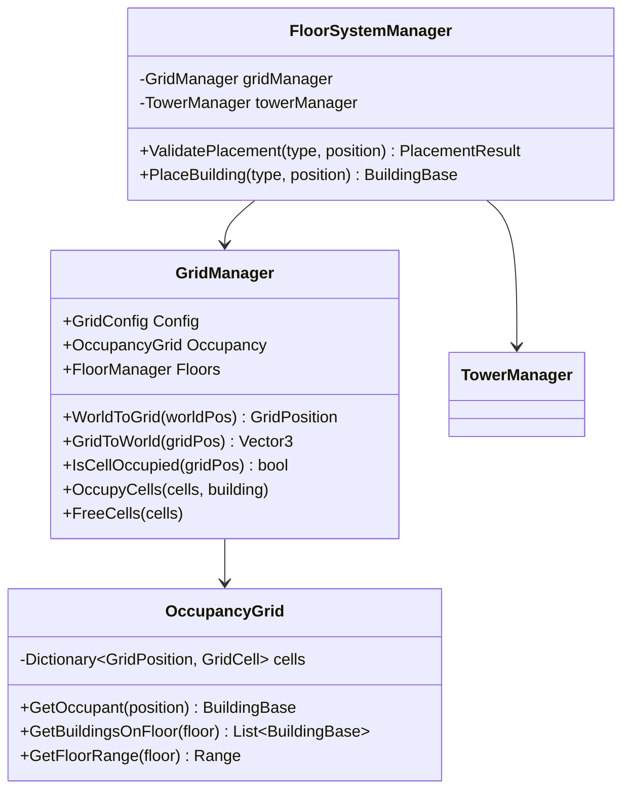
```mermaid
classDiagram
    class GridManager {
        +GridConfig Config
        +OccupancyGrid Occupancy
        +FloorManager Floors
        +WorldToGrid(worldPos) GridPosition
        +GridToWorld(gridPos) Vector3
        +IsCellOccupied(gridPos) bool
        +OccupyCells(cells, building)
        +FreeCells(cells)
    }

    class FloorSystemManager {
        -GridManager gridManager
        -TowerManager towerManager
        +ValidatePlacement(type, position) PlacementResult
        +PlaceBuilding(type, position) BuildingBase
    }

    class OccupancyGrid {
        -Dictionary~GridPosition, GridCell~ cells
        +GetOccupant(position) BuildingBase
        +GetBuildingsOnFloor(floor) List~BuildingBase~
        +GetFloorRange(floor) Range
    }

    GridManager --> OccupancyGrid
    FloorSystemManager --> GridManager
    FloorSystemManager --> TowerManager
```

### 7.2 セル占有の階層

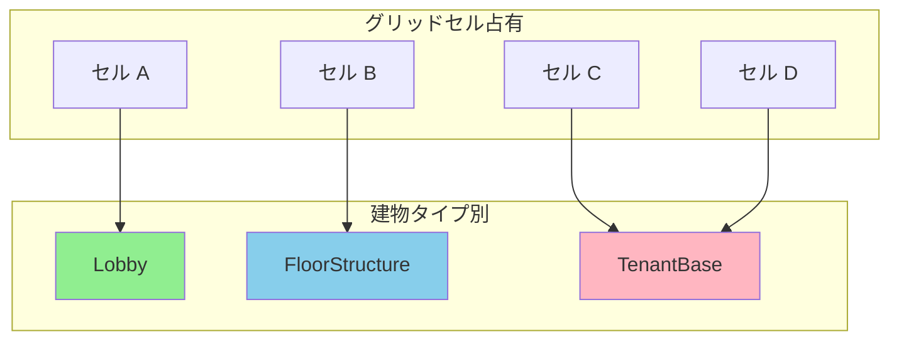
```mermaid
graph TB
    subgraph "グリッドセル占有"
        C1[セル A]
        C2[セル B]
        C3[セル C]
        C4[セル D]
    end

    subgraph "建物タイプ別"
        L[Lobby]
        F[FloorStructure]
        T[TenantBase]
    end

    C1 --> L
    C2 --> F
    C3 --> T
    C4 --> T

    style L fill:#90EE90
    style F fill:#87CEEB
    style T fill:#FFB6C1
```

### 7.3 拡張された GridCell

```csharp
/// <summary>
/// 拡張されたグリッドセル
/// 建物階層情報を含む
/// </summary>
public class GridCell
{
    /// <summary>セグメント位置</summary>
    public int X { get; set; }

    /// <summary>フロア番号</summary>
    public int Floor { get; set; }

    /// <summary>占有している建物</summary>
    public BuildingBase Occupant { get; set; }

    /// <summary>占有されているか</summary>
    public bool IsOccupied => Occupant != null;

    /// <summary>セルタイプ</summary>
    public CellType Type { get; set; }

    /// <summary>建物カテゴリ（占有時）</summary>
    public BuildingCategory? OccupantCategory => Occupant?.Category;

    /// <summary>テナントが配置可能か（フロア構造体の上か）</summary>
    public bool CanPlaceTenant => Occupant is FloorStructure;

    /// <summary>フロアが配置可能か（支持構造の上か）</summary>
    public bool CanPlaceFloor =>
        Occupant is Lobby ||
        Occupant is FloorStructure;
}

public enum CellType
{
    Empty,
    Lobby,
    Floor,
    Tenant,
    Transportation,
    Reserved
}
```

### 7.4 階層対応の占有チェック

```csharp
/// <summary>
/// 階層を考慮した配置可否チェック
/// </summary>
public class HierarchicalOccupancyChecker
{
    private readonly OccupancyGrid _occupancy;
    private readonly TowerManager _towers;

    /// <summary>
    /// 指定位置にロビーを配置可能か
    /// </summary>
    public bool CanPlaceLobby(GridPosition position, int width)
    {
        // 1Fチェック
        if (position.Floor != GridConfig.LOBBY_FLOOR)
            return false;

        // 既存ロビーチェック
        // 同じ位置の建物（ツインタワー判定込み）
        if (_towers.LobbyExistsNear(position, GridConfig.TWIN_TOWER_DISTANCE))
            return false;

        // セル占有チェック
        return CheckCellsAvailable(position, width, position.Floor);
    }

    /// <summary>
    /// 指定位置にフロアを配置可能か
    /// </summary>
    public bool CanPlaceFloor(GridPosition position, int width)
    {
        // ロビー存在チェック
        var tower = _towers.GetTowerAtPosition(position);
        if (tower?.MainLobby == null)
            return false;

        // 1Fチェック（禁止）
        if (position.Floor == GridConfig.LOBBY_FLOOR)
            return false;

        // 支持チェック
        if (!FloorStructure.HasSufficientSupport(position, width))
            return false;

        // 幅チェック（下階の幅以下）
        int maxWidth = tower.GetMaxWidthAtFloor(position.Floor - 1);
        if (width > maxWidth)
            return false;

        // セル占有チェック
        return CheckCellsAvailable(position, width, position.Floor);
    }

    /// <summary>
    /// 指定位置にテナントを配置可能か
    /// </summary>
    public bool CanPlaceTenant(GridPosition position, int width)
    {
        // 1Fチェック（禁止）
        if (position.Floor == GridConfig.LOBBY_FLOOR)
            return false;

        // フロア構造体存在チェック
        var tower = _towers.GetTowerAtPosition(position);
        var floor = tower?.GetFloor(position.Floor);
        if (floor == null)
            return false;

        // フロア上のスペースチェック
        return floor.CanPlaceTenant(width, position.X);
    }

    private bool CheckCellsAvailable(GridPosition center, int width, int floor)
    {
        int halfWidth = width / 2;
        int startX = center.X - halfWidth;
        int endX = center.X + halfWidth - (width % 2 == 0 ? 1 : 0);

        for (int x = startX; x <= endX; x++)
        {
            if (_occupancy.IsCellOccupied(new GridPosition(x, floor)))
                return false;
        }

        return true;
    }
}
```

---

## 8. 配置バリデーション

### 8.1 バリデーション結果

```csharp
/// <summary>
/// 配置バリデーション結果
/// </summary>
public class PlacementResult
{
    /// <summary>配置可能かどうか</summary>
    public bool IsValid { get; private set; }

    /// <summary>エラーメッセージ</summary>
    public string ErrorMessage { get; private set; }

    /// <summary>エラータイプ</summary>
    public PlacementErrorType ErrorType { get; private set; }

    /// <summary>警告メッセージ（配置可能だが注意が必要な場合）</summary>
    public string WarningMessage { get; private set; }

    private PlacementResult() { }

    /// <summary>成功結果を作成</summary>
    public static PlacementResult Success()
    {
        return new PlacementResult
        {
            IsValid = true,
            ErrorType = PlacementErrorType.None
        };
    }

    /// <summary>成功結果（警告付き）を作成</summary>
    public static PlacementResult SuccessWithWarning(string warning)
    {
        return new PlacementResult
        {
            IsValid = true,
            ErrorType = PlacementErrorType.None,
            WarningMessage = warning
        };
    }

    /// <summary>エラー結果を作成</summary>
    public static PlacementResult Error(string message, PlacementErrorType type)
    {
        return new PlacementResult
        {
            IsValid = false,
            ErrorMessage = message,
            ErrorType = type
        };
    }
}

/// <summary>
/// 配置エラータイプ
/// </summary>
public enum PlacementErrorType
{
    /// <summary>エラーなし</summary>
    None,

    /// <summary>ロビーが存在しない</summary>
    NoLobby,

    /// <summary>無効なフロア番号</summary>
    InvalidFloor,

    /// <summary>下階の支持が不十分</summary>
    InsufficientSupport,

    /// <summary>下階の幅を超過</summary>
    WidthExceeded,

    /// <summary>フロア構造体がない</summary>
    NoFloorStructure,

    /// <summary>スペースが占有されている</summary>
    SpaceOccupied,

    /// <summary>無効な位置</summary>
    InvalidPosition,

    /// <summary>ロビー階にテナント配置不可</summary>
    LobbyFloorRestriction,

    /// <summary>ロビーは1つのみ</summary>
    LobbyAlreadyExists,

    /// <summary>グリッド境界外</summary>
    OutOfBounds
}
```

### 8.2 バリデーションルールエンジン

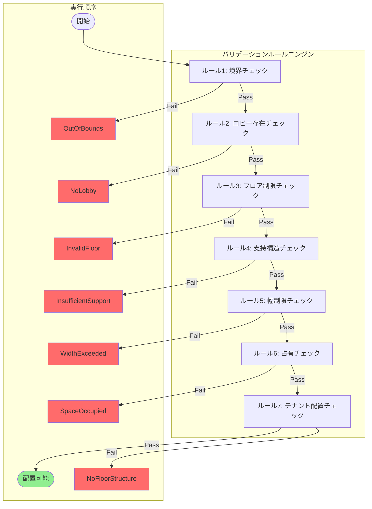
```mermaid
graph TB
    subgraph "バリデーションルールエンジン"
        R1[ルール1: 境界チェック]
        R2[ルール2: ロビー存在チェック]
        R3[ルール3: フロア制限チェック]
        R4[ルール4: 支持構造チェック]
        R5[ルール5: 幅制限チェック]
        R6[ルール6: 占有チェック]
        R7[ルール7: テナント配置チェック]
    end

    subgraph "実行順序"
        START([開始]) --> R1
        R1 -->|Pass| R2
        R1 -->|Fail| FAIL1[OutOfBounds]
        R2 -->|Pass| R3
        R2 -->|Fail| FAIL2[NoLobby]
        R3 -->|Pass| R4
        R3 -->|Fail| FAIL3[InvalidFloor]
        R4 -->|Pass| R5
        R4 -->|Fail| FAIL4[InsufficientSupport]
        R5 -->|Pass| R6
        R5 -->|Fail| FAIL5[WidthExceeded]
        R6 -->|Pass| R7
        R6 -->|Fail| FAIL6[SpaceOccupied]
        R7 -->|Pass| SUCCESS([配置可能])
        R7 -->|Fail| FAIL7[NoFloorStructure]
    end

    style SUCCESS fill:#90EE90
    style FAIL1 fill:#FF6B6B
    style FAIL2 fill:#FF6B6B
    style FAIL3 fill:#FF6B6B
    style FAIL4 fill:#FF6B6B
    style FAIL5 fill:#FF6B6B
    style FAIL6 fill:#FF6B6B
    style FAIL7 fill:#FF6B6B
```

### 8.3 FloorSystemManager 実装

```csharp
using UnityEngine;

namespace TowerGame.Building
{
    /// <summary>
    /// フロアシステム管理クラス
    /// The Tower II 階層ルールに基づく配置バリデーションと実行
    /// </summary>
    public class FloorSystemManager : MonoBehaviour
    {
        #region Singleton

        public static FloorSystemManager Instance { get; private set; }

        private void Awake()
        {
            if (Instance != null && Instance != this)
            {
                Destroy(gameObject);
                return;
            }
            Instance = this;
        }

        #endregion

        #region References

        [SerializeField] private GridManager gridManager;
        [SerializeField] private TowerManager towerManager;

        [Header("プレハブ")]
        [SerializeField] private GameObject lobbyPrefab;
        [SerializeField] private GameObject floorPrefab;
        [SerializeField] private GameObject officePrefab;
        [SerializeField] private GameObject shopPrefab;

        #endregion

        #region Validation Methods

        /// <summary>
        /// 配置バリデーション（統合メソッド）
        /// </summary>
        public PlacementResult ValidatePlacement(BuildingType type, GridPosition position, int width = 0)
        {
            switch (type)
            {
                case BuildingType.Lobby:
                    return ValidateLobbyPlacement(position, width);

                case BuildingType.Floor:
                    return ValidateFloorPlacement(position, width);

                default:
                    if (IsTenantType(type))
                    {
                        return ValidateTenantPlacement(type, position, width);
                    }
                    return PlacementResult.Error("未対応の建物タイプ", PlacementErrorType.InvalidPosition);
            }
        }

        /// <summary>
        /// ロビー配置バリデーション
        /// </summary>
        public PlacementResult ValidateLobbyPlacement(GridPosition position, int width)
        {
            // ルール1: 1Fのみ
            if (position.Floor != GridConfig.LOBBY_FLOOR)
            {
                return PlacementResult.Error(
                    "ロビーは1Fにのみ配置できます",
                    PlacementErrorType.InvalidFloor
                );
            }

            // ルール2: 境界チェック
            if (!IsWithinBounds(position, width))
            {
                return PlacementResult.Error(
                    "配置位置がグリッド境界外です",
                    PlacementErrorType.OutOfBounds
                );
            }

            // ルール3: 既存ロビーチェック（ツインタワー対応）
            if (towerManager.LobbyExistsNear(position, GridConfig.TWIN_TOWER_DISTANCE))
            {
                return PlacementResult.Error(
                    "近くに既にロビーが存在します（ツインタワーには9セグメント以上の距離が必要）",
                    PlacementErrorType.LobbyAlreadyExists
                );
            }

            // ルール4: セル占有チェック
            if (!AreCellsAvailable(position, width, position.Floor))
            {
                return PlacementResult.Error(
                    "指定位置は既に占有されています",
                    PlacementErrorType.SpaceOccupied
                );
            }

            return PlacementResult.Success();
        }

        /// <summary>
        /// フロア配置バリデーション
        /// </summary>
        public PlacementResult ValidateFloorPlacement(GridPosition position, int width)
        {
            // ルール1: ロビー存在チェック
            var tower = towerManager.GetTowerAtPosition(position);
            if (tower?.MainLobby == null)
            {
                return PlacementResult.Error(
                    "先にロビーを配置してください",
                    PlacementErrorType.NoLobby
                );
            }

            // ルール2: 1F禁止
            if (position.Floor == GridConfig.LOBBY_FLOOR)
            {
                return PlacementResult.Error(
                    "1Fにはロビーを配置してください",
                    PlacementErrorType.InvalidFloor
                );
            }

            // ルール3: 境界チェック
            if (!IsWithinBounds(position, width))
            {
                return PlacementResult.Error(
                    "配置位置がグリッド境界外です",
                    PlacementErrorType.OutOfBounds
                );
            }

            // ルール4: 支持チェック
            if (!FloorStructure.HasSufficientSupport(position, width))
            {
                return PlacementResult.Error(
                    $"下階の支持が不十分です（{FloorStructure.REQUIRED_SUPPORT_RATIO * 100}%以上必要）",
                    PlacementErrorType.InsufficientSupport
                );
            }

            // ルール5: 幅制限チェック
            int maxWidth = tower.GetMaxWidthAtFloor(position.Floor - 1);
            if (width > maxWidth)
            {
                return PlacementResult.Error(
                    $"下階の幅（{maxWidth}セグメント）を超えることはできません",
                    PlacementErrorType.WidthExceeded
                );
            }

            // ルール6: セル占有チェック
            if (!AreCellsAvailable(position, width, position.Floor))
            {
                return PlacementResult.Error(
                    "指定位置は既に占有されています",
                    PlacementErrorType.SpaceOccupied
                );
            }

            return PlacementResult.Success();
        }

        /// <summary>
        /// テナント配置バリデーション
        /// </summary>
        public PlacementResult ValidateTenantPlacement(BuildingType type, GridPosition position, int width)
        {
            // ルール1: ロビー階禁止
            if (position.Floor == GridConfig.LOBBY_FLOOR)
            {
                return PlacementResult.Error(
                    "ロビー階（1F）にテナントは配置できません",
                    PlacementErrorType.LobbyFloorRestriction
                );
            }

            // ルール2: フロア構造体存在チェック
            var tower = towerManager.GetTowerAtPosition(position);
            var floor = tower?.GetFloor(position.Floor);
            if (floor == null)
            {
                return PlacementResult.Error(
                    "テナント配置にはフロア構造体が必要です",
                    PlacementErrorType.NoFloorStructure
                );
            }

            // ルール3: フロア上のスペースチェック
            if (!floor.CanPlaceTenant(width, position.X))
            {
                return PlacementResult.Error(
                    "フロア上のスペースが不足しています",
                    PlacementErrorType.SpaceOccupied
                );
            }

            return PlacementResult.Success();
        }

        #endregion

        #region Placement Methods

        /// <summary>
        /// ロビー配置
        /// </summary>
        public Lobby PlaceLobby(GridPosition position, int width = Lobby.DEFAULT_LOBBY_WIDTH)
        {
            var result = ValidateLobbyPlacement(position, width);
            if (!result.IsValid)
            {
                Debug.LogError($"ロビー配置失敗: {result.ErrorMessage}");
                return null;
            }

            // インスタンス生成
            var lobbyObj = Instantiate(lobbyPrefab);
            var lobby = lobbyObj.GetComponent<Lobby>();

            // 初期化
            lobby.Initialize(position);

            // タワー作成・登録
            int towerId = towerManager.CreateTower(position);
            lobby.TowerId = towerId;

            // グリッド占有
            var cells = lobby.GetOccupiedCells();
            gridManager.OccupyCells(cells, lobby);

            return lobby;
        }

        /// <summary>
        /// フロア配置
        /// </summary>
        public FloorStructure PlaceFloor(GridPosition position, int width)
        {
            var result = ValidateFloorPlacement(position, width);
            if (!result.IsValid)
            {
                Debug.LogError($"フロア配置失敗: {result.ErrorMessage}");
                return null;
            }

            // インスタンス生成
            var floorObj = Instantiate(floorPrefab);
            var floor = floorObj.GetComponent<FloorStructure>();

            // 初期化
            floor.Initialize(position, width);

            // タワーに登録
            var tower = towerManager.GetTowerAtPosition(position);
            tower.RegisterFloor(floor);
            floor.TowerId = tower.TowerId;

            // グリッド占有
            var cells = floor.GetOccupiedCells();
            gridManager.OccupyCells(cells, floor);

            return floor;
        }

        /// <summary>
        /// テナント配置
        /// </summary>
        public TenantBase PlaceTenant(BuildingType type, GridPosition position)
        {
            int width = GetBuildingWidth(type);
            var result = ValidateTenantPlacement(type, position, width);
            if (!result.IsValid)
            {
                Debug.LogError($"テナント配置失敗: {result.ErrorMessage}");
                return null;
            }

            // プレハブ選択
            var prefab = GetTenantPrefab(type);
            if (prefab == null)
            {
                Debug.LogError($"テナントプレハブが見つかりません: {type}");
                return null;
            }

            // インスタンス生成
            var tenantObj = Instantiate(prefab);
            var tenant = tenantObj.GetComponent<TenantBase>();

            // 初期化
            tenant.Initialize(position);

            // フロアに登録
            var tower = towerManager.GetTowerAtPosition(position);
            var floor = tower.GetFloor(position.Floor);
            floor.RegisterTenant(tenant);
            tenant.TowerId = tower.TowerId;

            return tenant;
        }

        #endregion

        #region Helper Methods

        private bool IsWithinBounds(GridPosition position, int width)
        {
            int halfWidth = width / 2;
            int startX = position.X - halfWidth;
            int endX = position.X + halfWidth - (width % 2 == 0 ? 1 : 0);

            return startX >= gridManager.Config.MinSegmentX &&
                   endX <= gridManager.Config.MaxSegmentX;
        }

        private bool AreCellsAvailable(GridPosition center, int width, int floor)
        {
            int halfWidth = width / 2;
            int startX = center.X - halfWidth;
            int endX = center.X + halfWidth - (width % 2 == 0 ? 1 : 0);

            for (int x = startX; x <= endX; x++)
            {
                if (gridManager.IsCellOccupied(new GridPosition(x, floor)))
                    return false;
            }

            return true;
        }

        private bool IsTenantType(BuildingType type)
        {
            return type >= BuildingType.Office && type < BuildingType.Elevator;
        }

        private int GetBuildingWidth(BuildingType type)
        {
            // BuildingSizeDefinition から取得（または定数）
            return type switch
            {
                BuildingType.Office => 9,
                BuildingType.Shop => 4,
                BuildingType.Restaurant => 6,
                _ => 4
            };
        }

        private GameObject GetTenantPrefab(BuildingType type)
        {
            return type switch
            {
                BuildingType.Office => officePrefab,
                BuildingType.Shop => shopPrefab,
                _ => null
            };
        }

        #endregion
    }
}
```

---

## 9. ツインタワー対応

### 9.1 ツインタワーの概念

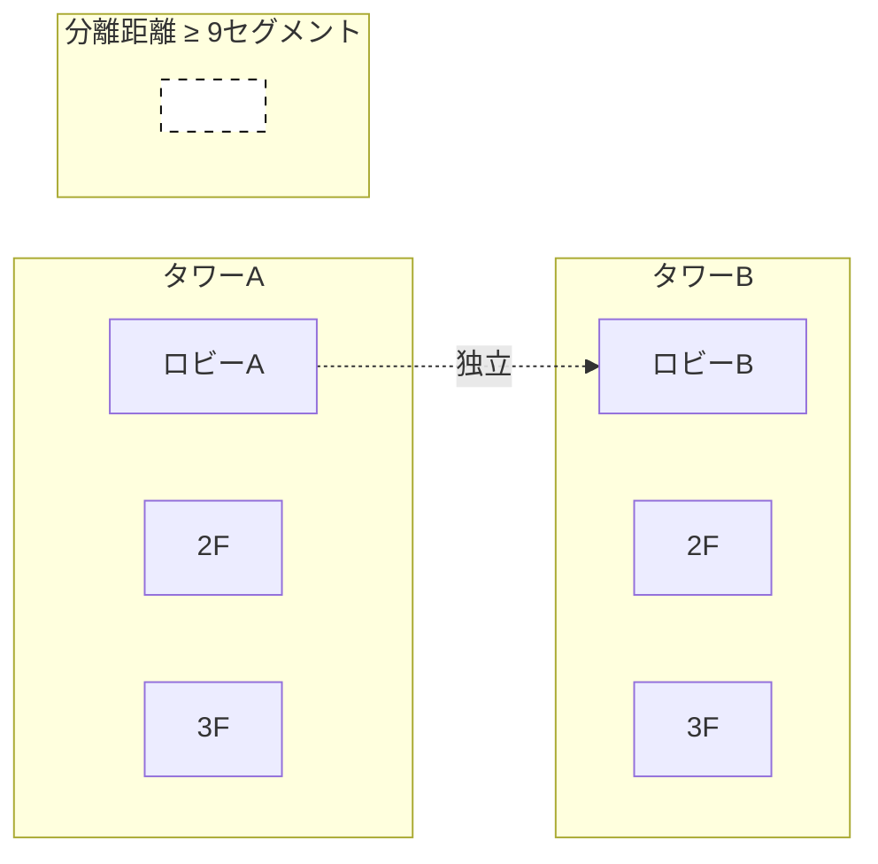
```mermaid
graph LR
    subgraph "タワーA"
        LA[ロビーA]
        FA1[2F]
        FA2[3F]
    end

    subgraph "分離距離 ≥ 9セグメント"
        GAP[　　　　　　　　　　　]
    end

    subgraph "タワーB"
        LB[ロビーB]
        FB1[2F]
        FB2[3F]
    end

    LA -.->|独立| LB

    style GAP fill:#FFFFFF,stroke:#000000,stroke-dasharray: 5 5
```

### 9.2 タワー分離判定

```csharp
/// <summary>
/// ツインタワー対応のタワーマネージャー
/// </summary>
public class TowerManager : MonoBehaviour
{
    /// <summary>ツインタワー判定の最小距離（セグメント）</summary>
    public const int TWIN_TOWER_DISTANCE = 9;

    private Dictionary<int, TowerData> _towers = new Dictionary<int, TowerData>();
    private int _nextTowerId = 1;

    /// <summary>
    /// 指定位置の近くにロビーが存在するか（ツインタワー判定）
    /// </summary>
    public bool LobbyExistsNear(GridPosition position, int distance)
    {
        foreach (var tower in _towers.Values)
        {
            if (tower.MainLobby == null) continue;

            int lobbyDistance = Mathf.Abs(position.X - tower.MainLobby.Position.X);
            if (lobbyDistance < distance)
            {
                return true;
            }
        }
        return false;
    }

    /// <summary>
    /// 2つの位置が別のタワーに属するか判定
    /// </summary>
    public bool AreTowersSeparate(GridPosition pos1, GridPosition pos2)
    {
        int distance = Mathf.Abs(pos1.X - pos2.X);
        return distance >= TWIN_TOWER_DISTANCE;
    }

    /// <summary>
    /// 指定位置のタワーを取得
    /// </summary>
    public TowerData GetTowerAtPosition(GridPosition position)
    {
        foreach (var tower in _towers.Values)
        {
            if (tower.ContainsPosition(position))
            {
                return tower;
            }
        }
        return null;
    }

    /// <summary>
    /// 新しいタワーを作成
    /// </summary>
    public int CreateTower(GridPosition lobbyPosition)
    {
        int towerId = _nextTowerId++;
        var towerData = new TowerData(towerId);
        _towers[towerId] = towerData;
        return towerId;
    }
}

/// <summary>
/// タワーデータ
/// </summary>
public class TowerData
{
    public int TowerId { get; }
    public Lobby MainLobby { get; set; }
    public Dictionary<int, FloorStructure> Floors { get; } = new Dictionary<int, FloorStructure>();
    public List<BuildingBase> AllBuildings { get; } = new List<BuildingBase>();

    public int HighestFloor => Floors.Count > 0 ? Floors.Keys.Max() : 1;
    public int LeftBoundary => MainLobby?.LeftBoundary ?? 0;
    public int RightBoundary => MainLobby?.RightBoundary ?? 0;

    public TowerData(int id)
    {
        TowerId = id;
    }

    public FloorStructure GetFloor(int floorNumber)
    {
        return Floors.TryGetValue(floorNumber, out var floor) ? floor : null;
    }

    public void RegisterFloor(FloorStructure floor)
    {
        Floors[floor.FloorNumber] = floor;
        AllBuildings.Add(floor);
    }

    public int GetMaxWidthAtFloor(int floorNumber)
    {
        if (floorNumber == 1 && MainLobby != null)
        {
            return MainLobby.CurrentWidth;
        }

        var floor = GetFloor(floorNumber);
        return floor?.WidthSegments ?? 0;
    }

    public bool ContainsPosition(GridPosition position)
    {
        if (MainLobby == null) return false;

        // X座標がタワーの範囲内か
        if (position.X < LeftBoundary || position.X > RightBoundary)
            return false;

        // フロアが存在するか
        if (position.Floor == 1) return true;
        return Floors.ContainsKey(position.Floor);
    }
}
```

### 9.3 ツインタワー配置例

```
ツインタワー配置例:

セグメント位置:
-20  -15  -10  -5   0   +5  +10  +15  +20
 │    │    │    │   │    │    │    │    │

 [タワーA]           [9セグメント]        [タワーB]
 ┌────────────┐  ←──────────────→  ┌────────────┐
 │ ロビーA     │                    │ ロビーB     │
 │ X: -12     │                    │ X: +12     │
 │ 幅: 9      │                    │ 幅: 9      │
 └────────────┘                    └────────────┘

 距離計算: |(-12) - (+12)| = 24 セグメント ≥ 9 → 別タワー認定
```

---

## 10. 実装優先度チェックリスト

### 10.1 Phase 1: コアシステム（優先度: 最高）

**目標**: 基本的な階層構造の実装

- [ ] **BuildingType 拡張**
  - [ ] Lobby, Floor を BuildingType に追加
  - [ ] BuildingCategory 列挙型の作成
  - [ ] TenantCategory 列挙型の作成

- [ ] **Lobby クラス実装**
  - [ ] 基本プロパティ（幅、境界、エントランス位置）
  - [ ] 1F配置制限ロジック
  - [ ] 単一ロビー制限ロジック
  - [ ] 基本ビジュアル生成

- [ ] **FloorStructure クラス実装**
  - [ ] 基本プロパティ（フロア番号、幅、境界）
  - [ ] 2F以上配置制限ロジック
  - [ ] 支持構造チェック（100%ルール - オーバーハング禁止）
  - [ ] 幅制限チェック（オーバーハング禁止）

- [ ] **TowerManager 実装**
  - [ ] タワーデータ管理
  - [ ] ロビー登録・取得
  - [ ] タワー境界計算

### 10.2 Phase 2: テナントシステム（優先度: 高）

**目標**: テナント配置の実装

- [ ] **TenantBase 抽象クラス実装**
  - [ ] 共通プロパティ（容量、収益、営業時間）
  - [ ] 入退室管理
  - [ ] 営業開始・終了イベント

- [ ] **OfficeTenant 実装**
  - [ ] 既存 OfficeBuilding からの移行
  - [ ] フロア依存配置ロジック
  - [ ] 従業員割り当て機能

- [ ] **FloorStructure テナント管理**
  - [ ] テナント登録・解除
  - [ ] 占有マップ管理
  - [ ] 空きスペース計算

### 10.3 Phase 3: バリデーションシステム（優先度: 高）

**目標**: 配置ルールの完全実装

- [ ] **FloorSystemManager 実装**
  - [ ] ValidateLobbyPlacement()
  - [ ] ValidateFloorPlacement()
  - [ ] ValidateTenantPlacement()
  - [ ] PlaceLobby(), PlaceFloor(), PlaceTenant()

- [ ] **PlacementResult 実装**
  - [ ] エラータイプ定義
  - [ ] エラーメッセージ生成
  - [ ] UI連携用フォーマット

- [ ] **BuildingPlacer 統合**
  - [ ] FloorSystemManager との連携
  - [ ] 階層別プレビュー表示
  - [ ] バリデーション結果のUI反映

### 10.4 Phase 4: ツインタワー対応（優先度: 中）

**目標**: 複数タワーのサポート

- [ ] **タワー分離判定**
  - [ ] 距離ベース判定（9セグメント）
  - [ ] 独立したタワーID管理
  - [ ] タワー別ロビー許可

- [ ] **TowerData 拡張**
  - [ ] ContainsPosition() 最適化
  - [ ] タワー間の関係管理

### 10.5 Phase 5: 拡張テナント（優先度: 低）

**目標**: 追加テナントタイプの実装

- [ ] **ShopTenant 実装**
  - [ ] 顧客流入シミュレーション
  - [ ] 売上計算

- [ ] **RestaurantTenant 実装**
  - [ ] 座席管理
  - [ ] ピーク時間対応

- [ ] **Lobby 拡張機能**
  - [ ] 左右拡張機能
  - [ ] 交通施設登録

### 10.6 実装スケジュール概要

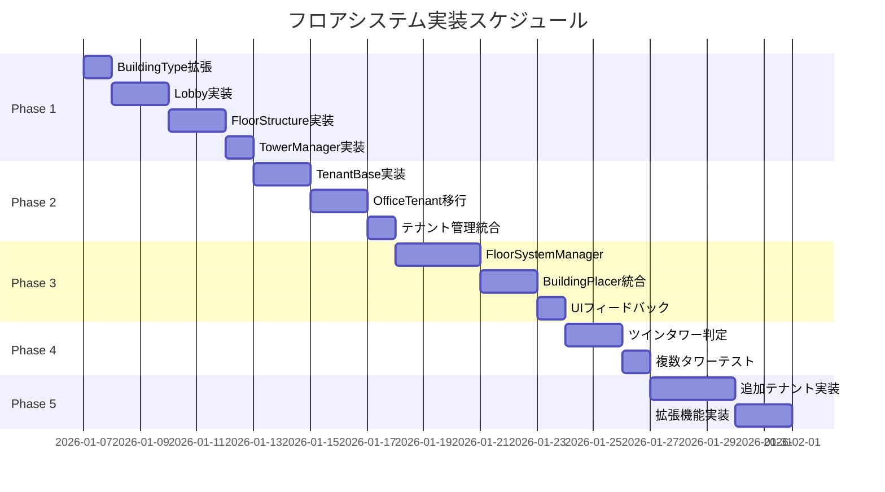
```mermaid
gantt
    title フロアシステム実装スケジュール
    dateFormat  YYYY-MM-DD
    section Phase 1
    BuildingType拡張          :a1, 2026-01-07, 1d
    Lobby実装                 :a2, after a1, 2d
    FloorStructure実装        :a3, after a2, 2d
    TowerManager実装          :a4, after a3, 1d

    section Phase 2
    TenantBase実装            :b1, after a4, 2d
    OfficeTenant移行          :b2, after b1, 2d
    テナント管理統合          :b3, after b2, 1d

    section Phase 3
    FloorSystemManager        :c1, after b3, 3d
    BuildingPlacer統合        :c2, after c1, 2d
    UIフィードバック          :c3, after c2, 1d

    section Phase 4
    ツインタワー判定          :d1, after c3, 2d
    複数タワーテスト          :d2, after d1, 1d

    section Phase 5
    追加テナント実装          :e1, after d2, 3d
    拡張機能実装              :e2, after e1, 2d
```

---

## 11. マイグレーションノート

### 11.1 既存コードからの移行

#### 11.1.1 OfficeBuilding の移行

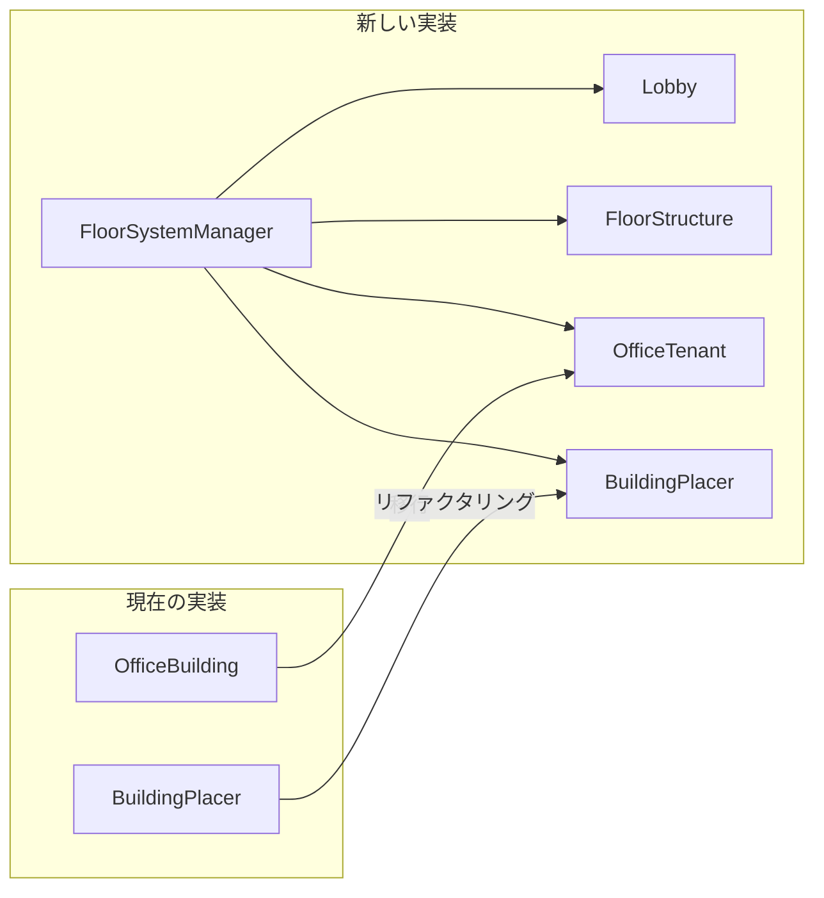
```mermaid
flowchart LR
    subgraph "現在の実装"
        OB[OfficeBuilding]
        BP1[BuildingPlacer]
    end

    subgraph "新しい実装"
        L[Lobby]
        FS[FloorStructure]
        OT[OfficeTenant]
        FSM[FloorSystemManager]
        BP2[BuildingPlacer]
    end

    OB -->|移行| OT
    BP1 -->|リファクタリング| BP2
    FSM --> BP2
    FSM --> L
    FSM --> FS
    FSM --> OT
```

#### 11.1.2 コード変更一覧

| ファイル | 変更内容 |
|---------|---------|
| `BuildingType.cs` | Lobby, Floor を追加 |
| `OfficeBuilding.cs` | OfficeTenant へ改名・TenantBase 継承 |
| `BuildingPlacer.cs` | FloorSystemManager と連携 |
| `GridManager.cs` | 階層対応の拡張 |
| **新規** `Lobby.cs` | ロビークラス追加 |
| **新規** `FloorStructure.cs` | フロア構造体追加 |
| **新規** `TenantBase.cs` | テナント基底クラス追加 |
| **新規** `FloorSystemManager.cs` | フロアシステム管理追加 |
| **新規** `TowerManager.cs` | タワー管理追加 |

### 11.2 データ構造の変換

```csharp
// === 移行前 ===
// OfficeBuilding は直接グリッドに配置
BuildingPlacer.Instance.PlaceBuilding(BuildingType.Office, position);

// === 移行後 ===
// 階層構造に従って配置
// Step 1: ロビー配置（必須）
var lobby = FloorSystemManager.Instance.PlaceLobby(lobbyPosition);

// Step 2: フロア配置
var floor = FloorSystemManager.Instance.PlaceFloor(
    new GridPosition(0, 2),  // 2F
    width: 9
);

// Step 3: テナント配置
var office = FloorSystemManager.Instance.PlaceTenant(
    BuildingType.Office,
    new GridPosition(0, 2)
);
```

### 11.3 後方互換性

**対応方針**: 段階的移行

1. **Phase 1**: 新システムを並行実装（既存コード維持）
2. **Phase 2**: 新規配置は新システム経由
3. **Phase 3**: 既存建物の変換ユーティリティ実装
4. **Phase 4**: 旧システムコードの削除

```csharp
/// <summary>
/// 既存 OfficeBuilding を新システムに変換
/// </summary>
public static class LegacyBuildingConverter
{
    public static OfficeTenant ConvertOfficeBuilding(OfficeBuilding legacy)
    {
        // 1. ロビーが存在しない場合は作成
        var tower = TowerManager.Instance.GetTowerAtPosition(legacy.Position);
        if (tower == null)
        {
            var lobbyPos = new GridPosition(legacy.Position.X, GridConfig.LOBBY_FLOOR);
            FloorSystemManager.Instance.PlaceLobby(lobbyPos);
        }

        // 2. フロアが存在しない場合は作成
        if (legacy.Position.Floor > 1)
        {
            var floor = tower?.GetFloor(legacy.Position.Floor);
            if (floor == null)
            {
                FloorSystemManager.Instance.PlaceFloor(
                    legacy.Position,
                    legacy.GridSize.x
                );
            }
        }

        // 3. OfficeTenant として再作成
        var tenant = FloorSystemManager.Instance.PlaceTenant(
            BuildingType.Office,
            legacy.Position
        ) as OfficeTenant;

        // 4. 既存データの移行
        tenant.TransferDataFrom(legacy);

        // 5. 旧オブジェクト削除
        Object.Destroy(legacy.gameObject);

        return tenant;
    }
}
```

### 11.4 テスト項目

#### ユニットテスト

```csharp
[TestFixture]
public class FloorSystemTests
{
    [Test]
    public void Lobby_CanOnlyBePlacedOn1F()
    {
        var result = FloorSystemManager.Instance.ValidateLobbyPlacement(
            new GridPosition(0, 2),  // 2F
            width: 9
        );

        Assert.IsFalse(result.IsValid);
        Assert.AreEqual(PlacementErrorType.InvalidFloor, result.ErrorType);
    }

    [Test]
    public void Floor_RequiresLobbyFirst()
    {
        var result = FloorSystemManager.Instance.ValidateFloorPlacement(
            new GridPosition(0, 2),
            width: 9
        );

        Assert.IsFalse(result.IsValid);
        Assert.AreEqual(PlacementErrorType.NoLobby, result.ErrorType);
    }

    [Test]
    public void Tenant_CannotBePlacedOn1F()
    {
        // ロビー配置
        FloorSystemManager.Instance.PlaceLobby(new GridPosition(0, 1));

        var result = FloorSystemManager.Instance.ValidateTenantPlacement(
            BuildingType.Office,
            new GridPosition(0, 1),  // 1F
            width: 9
        );

        Assert.IsFalse(result.IsValid);
        Assert.AreEqual(PlacementErrorType.LobbyFloorRestriction, result.ErrorType);
    }

    [Test]
    public void Tenant_RequiresFloorStructure()
    {
        // ロビーのみ配置（フロアなし）
        FloorSystemManager.Instance.PlaceLobby(new GridPosition(0, 1));

        var result = FloorSystemManager.Instance.ValidateTenantPlacement(
            BuildingType.Office,
            new GridPosition(0, 2),  // 2F
            width: 9
        );

        Assert.IsFalse(result.IsValid);
        Assert.AreEqual(PlacementErrorType.NoFloorStructure, result.ErrorType);
    }

    [Test]
    public void Floor_CannotExceedWidthBelow()
    {
        // ロビー配置（幅9）
        FloorSystemManager.Instance.PlaceLobby(new GridPosition(0, 1), width: 9);

        // 幅12のフロアを配置しようとする
        var result = FloorSystemManager.Instance.ValidateFloorPlacement(
            new GridPosition(0, 2),
            width: 12
        );

        Assert.IsFalse(result.IsValid);
        Assert.AreEqual(PlacementErrorType.WidthExceeded, result.ErrorType);
    }

    [Test]
    public void TwinTower_AllowsSeparateLobbies()
    {
        // タワーA のロビー
        FloorSystemManager.Instance.PlaceLobby(new GridPosition(-15, 1));

        // タワーB のロビー（距離 = 30 > 9）
        var result = FloorSystemManager.Instance.ValidateLobbyPlacement(
            new GridPosition(15, 1),
            width: 9
        );

        Assert.IsTrue(result.IsValid);
    }
}
```

#### 統合テスト

```csharp
[TestFixture]
public class FloorSystemIntegrationTests
{
    [Test]
    public void FullBuildingConstruction_WorksCorrectly()
    {
        // 1. ロビー配置
        var lobby = FloorSystemManager.Instance.PlaceLobby(new GridPosition(0, 1));
        Assert.IsNotNull(lobby);

        // 2. 2Fフロア配置
        var floor2 = FloorSystemManager.Instance.PlaceFloor(new GridPosition(0, 2), 9);
        Assert.IsNotNull(floor2);

        // 3. 2Fにオフィス配置
        var office = FloorSystemManager.Instance.PlaceTenant(BuildingType.Office, new GridPosition(0, 2));
        Assert.IsNotNull(office);
        Assert.AreEqual(floor2, office.ParentFloor);

        // 4. 3Fフロア配置（幅を狭める）
        var floor3 = FloorSystemManager.Instance.PlaceFloor(new GridPosition(0, 3), 7);
        Assert.IsNotNull(floor3);
        Assert.IsTrue(floor3.WidthSegments <= floor2.WidthSegments);
    }
}
```

---

## 付録

### A. GridConfig 拡張

```csharp
/// <summary>
/// グリッド設定（フロアシステム対応版）
/// </summary>
[CreateAssetMenu(fileName = "GridConfig", menuName = "TowerGame/GridConfig")]
public class GridConfig : ScriptableObject
{
    [Header("基本設定")]
    public float SegmentSize = 1.0f;
    public float FloorHeight = 3.0f;
    public float GroundLevel = -3.0f;

    [Header("フロア設定")]
    public int LobbyFloor = 1;
    public int MaxFloors = 100;
    public int MinFloors = -5;  // 地下対応

    [Header("グリッド境界")]
    public int MinSegmentX = -50;
    public int MaxSegmentX = 50;

    [Header("ツインタワー設定")]
    public int TwinTowerDistance = 9;

    [Header("支持構造設定")]
    [Range(0.5f, 1.0f)]
    public float RequiredSupportRatio = 0.7f;

    // 定数アクセス用
    public static int LOBBY_FLOOR => Instance?.LobbyFloor ?? 1;
    public static int TWIN_TOWER_DISTANCE => Instance?.TwinTowerDistance ?? 9;

    private static GridConfig _instance;
    public static GridConfig Instance => _instance ??= Resources.Load<GridConfig>("GridConfig");
}
```

### B. イベントシステム

```csharp
/// <summary>
/// フロアシステムイベント
/// </summary>
public static class FloorSystemEvents
{
    /// <summary>ロビーが配置された</summary>
    public static event Action<Lobby> OnLobbyPlaced;

    /// <summary>フロアが配置された</summary>
    public static event Action<FloorStructure> OnFloorPlaced;

    /// <summary>テナントが配置された</summary>
    public static event Action<TenantBase> OnTenantPlaced;

    /// <summary>配置が失敗した</summary>
    public static event Action<PlacementResult> OnPlacementFailed;

    /// <summary>タワーが作成された</summary>
    public static event Action<TowerData> OnTowerCreated;

    // イベント発火メソッド
    internal static void RaiseLobbyPlaced(Lobby lobby) => OnLobbyPlaced?.Invoke(lobby);
    internal static void RaiseFloorPlaced(FloorStructure floor) => OnFloorPlaced?.Invoke(floor);
    internal static void RaiseTenantPlaced(TenantBase tenant) => OnTenantPlaced?.Invoke(tenant);
    internal static void RaisePlacementFailed(PlacementResult result) => OnPlacementFailed?.Invoke(result);
    internal static void RaiseTowerCreated(TowerData tower) => OnTowerCreated?.Invoke(tower);
}
```

---

## 変更履歴

| 日付 | バージョン | 内容 |
|------|-----------|------|
| 2026-01-06 | 1.0 | 初版作成 |

---

**End of Document**
