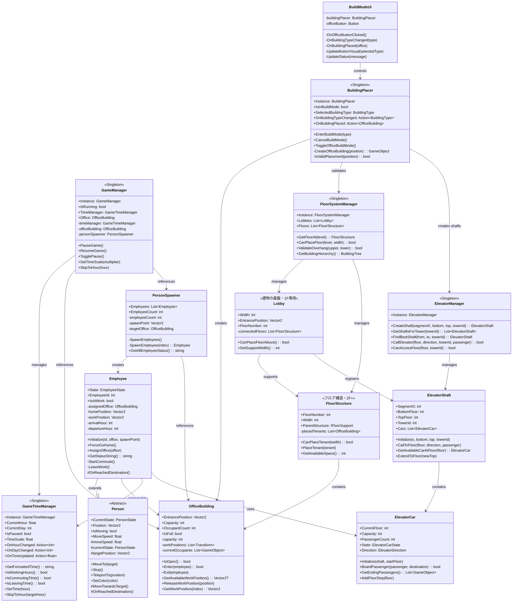

# Unity Tower Game - ゲーム仕様書

**バージョン**: 1.3
**最終更新日**: 2026-01-06
**対象プラットフォーム**: Unity 2D
**名前空間**: `TowerGame`

---

## 目次

1. [ゲーム概要](#1-ゲーム概要)
2. [現在実装済みの機能一覧](#2-現在実装済みの機能一覧)
3. [ゲームの座標系とサイズ設定](#3-ゲームの座標系とサイズ設定)
4. [各クラスの役割と関係図](#4-各クラスの役割と関係図)
5. [詳細クラス仕様](#5-詳細クラス仕様)
6. [今後の実装予定](#6-今後の実装予定)

---

## 1. ゲーム概要

### 1.1 ゲームコンセプト

**Unity Tower Game** は、名作シミュレーションゲーム **The Tower II** をインスピレーションとした2Dビル経営シミュレーションゲームです。

プレイヤーはオフィスビルを建設・管理し、従業員の通勤サイクルを観察しながらビルを発展させていきます。

### 1.2 ゲームの特徴

| 特徴 | 説明 |
|------|------|
| **2Dサイドビュー** | 建物の断面図を横から観察するスタイル |
| **時間経過システム** | 10秒 = 1ゲーム時間という加速された時間進行 |
| **従業員シミュレーション** | 出勤・退勤のサイクルを持つ自律的なキャラクター |
| **建設モード** | プレイヤーによるビル配置システム |

### 1.3 現在のゲームフロー


---

## 2. 現在実装済みの機能一覧

### 2.1 コアシステム

| 機能 | 状態 | 説明 |
|------|:----:|------|
| ゲーム管理 | 完了 | GameManager によるシングルトン管理 |
| 時間システム | 完了 | 10秒=1時間の時間進行 |
| 一時停止 | 完了 | Space キーでポーズ切替 |
| 速度変更 | 完了 | 1/2/4 キーで 1x/2x/4x 速度 |

### 2.2 建物システム

| 機能 | 状態 | 説明 |
|------|:----:|------|
| オフィスビル | 完了 | 従業員が勤務する建物 |
| ビル配置 | 完了 | マウスクリックで配置 |
| 配置プレビュー | 完了 | ゴースト表示と有効/無効判定 |
| 窓の表示 | 完了 | 占有状態で色が変化 |
| 営業時間 | 完了 | 8:00-18:00 の営業時間管理 |
| 複数フロア配置 | 完了 | 2F以上にオフィスを配置可能（下に支持構造が必要） |
| フロア表示 | 完了 | 配置モード中に現在のフロアを表示 |
| ロビー配置 | 完了 | 1Fにロビーを配置可能（建物の基盤） |
| フロア配置 | 完了 | 2F以上にフロア構造を配置可能 |
| The Tower II風階層システム | 完了 | Lobby → Floor → Office の順で配置 |
| エレベーター配置 | 完了 | ロビー内にエレベーターシャフトを配置可能 |
| エレベーター移動 | 完了 | 従業員が2F以上へエレベーターで移動可能 |

> **ビルド順序**: Lobby (1F) → Floor (2F+) → Office → Elevator

### 2.3 人物システム

| 機能 | 状態 | 説明 |
|------|:----:|------|
| 従業員生成 | 完了 | PersonSpawner による自動生成 |
| 移動システム | 完了 | 目的地への滑らかな移動 |
| 通勤サイクル | 完了 | 出勤→勤務→退勤の状態遷移 |
| 複数カラー | 完了 | 5色の従業員バリエーション |

### 2.4 UIシステム

| 機能 | 状態 | 説明 |
|------|:----:|------|
| 建設モードUI | 完了 | ボタンによる建設モード切替 |
| デバッグ表示 | 完了 | 時間・従業員数の表示 |

---

## 3. ゲームの座標系とサイズ設定

### 3.1 ワールド座標系

```
Y軸 (上)
  ^
  |     [建物エリア]
  |   +---------------+
  | 5 |               | Y = -0.5 (建物中心)
  |   |               |
  | 0 +---------------+ Y = -3.0 (地面レベル)
  |   =================== 地面
  |
--+-------------------------> X軸 (右)
     -20    0    +20
```

### 3.2 基本サイズ定義

| 要素 | サイズ/位置 | 単位 |
|------|------------|------|
| **地面レベル** | Y = -3.0 | ワールド座標 |
| **地面幅** | 40 (X: -20 〜 +20) | ユニット |
| **建物サイズ** | 幅 8 x 高さ 5 | ユニット |
| **建物間最小距離** | 1 | ユニット |
| **従業員サイズ** | 0.5 x 0.8 | ユニット |
| **スポーンポイント** | (-18, -3) | ワールド座標 |
| **従業員間隔** | 0.8 | ユニット |

### 3.3 フロアシステム

| 要素 | 値 | 説明 |
|------|-----|------|
| **フロア番号** | 0始まり | 0 = 1F, 1 = 2F, 2 = 3F... |
| **フロア高さ** | 5 ユニット | 建物1階分の高さ |
| **支持面積要件** | 70%以上 | 2F以上の配置に必要な下層の支持面積 |

**フロア配置ルール**:
- 1F（フロア0）: 地面に直接配置可能
- 2F以上: 配置予定エリアの70%以上が下層の建物で支えられている必要がある
- 支持判定は建物の幅に対するパーセンテージで計算

```
      [2F オフィス]     ← 配置には下の70%以上の支持が必要
  [1F オフィス][1F オフィス]
=================== 地面
```

### 3.4 The Tower II風建物階層システム

| 項目 | 内容 |
|------|------|
| **建物配置順序** | ロビー(1F) → フロア(2F+) → テナント(オフィスなど) |
| **オーバーハング禁止** | 上階は下階の幅を100%超えられない |

```
配置フロー:
1. ロビー配置（1F専用、建物の基盤）
2. フロア構造配置（2F以上）
3. テナント配置（オフィス等をフロア上に配置）

構造制約:
      [3F フロア + テナント]     ← 2Fの幅を超えられない
    [2F フロア + テナント]       ← 1Fロビーの幅を超えられない
[1F ロビー（基盤）]
=================== 地面
```

### 3.5 建物の座標計算

建物はピボットが中心にあるため、地面に接地させるには以下の計算が必要です：

```
建物Y座標 = 地面レベル + (建物高さ / 2)
         = -3.0 + (5.0 / 2)
         = -3.0 + 2.5
         = -0.5
```

### 3.6 スケールとローカル座標の関係

> **重要**: 親オブジェクトのスケールが子オブジェクトのローカル座標に影響します。

```
建物スケール: (8, 5, 1)

ローカルY = -0.5 の場合:
  ワールドY = 建物中心Y + (ローカルY * スケールY)
           = -0.5 + (-0.5 * 5)
           = -0.5 + (-2.5)
           = -3.0  (地面レベル)
```

---

## 4. 各クラスの役割と関係図

### 4.1 クラス関係図



### 4.2 名前空間構成


### 4.3 状態遷移図

#### 4.3.1 従業員状態 (EmployeeState)


#### 4.3.2 人物基本状態 (PersonState)


---

## 5. 詳細クラス仕様

### 5.1 GameManager

**役割**: ゲーム全体の統括管理

| メソッド | 説明 |
|----------|------|
| `PauseGame()` | ゲームを一時停止 |
| `ResumeGame()` | ゲームを再開 |
| `TogglePause()` | 一時停止を切替 |
| `SetTimeScale(float multiplier)` | 時間速度を設定（1x, 2x, 4x） |
| `SkipToHour(int hour)` | 指定時刻までスキップ |

**キーボード操作**:
- `Space`: 一時停止切替
- `1`: 1x速度
- `2`: 2x速度
- `4`: 4x速度

### 5.2 GameTimeManager

**役割**: ゲーム内時間の管理

| 設定値 | デフォルト | 説明 |
|--------|-----------|------|
| `timeScale` | 360 | 10秒 = 1時間 |
| `startHour` | 6.0 | ゲーム開始時刻（6:00 AM） |

**時間判定メソッド**:

| メソッド | 判定条件 |
|----------|----------|
| `IsWorkingHours()` | 8:00 - 18:00 |
| `IsCommutingTime()` | 7:00 - 8:30 |
| `IsLeavingTime()` | 17:30 - 19:00 |

### 5.3 OfficeBuilding

**役割**: オフィスビルの管理

| プロパティ | 型 | 説明 |
|------------|-----|------|
| `Capacity` | int | 最大収容人数（デフォルト: 10） |
| `OccupantCount` | int | 現在の入居者数 |
| `IsFull` | bool | 満員かどうか |
| `EntrancePosition` | Vector2 | 入口の座標 |

**営業時間**: 8:00 - 18:00

### 5.4 BuildingPlacer

**役割**: ビル配置の制御

| 設定値 | デフォルト | 説明 |
|--------|-----------|------|
| `groundLevel` | -3 | 地面の高さ |
| `buildingWidth` | 8 | 建物の幅 |
| `buildingHeight` | 5 | 建物の高さ |
| `minDistanceBetweenBuildings` | 1 | 建物間の最小距離 |

**配置可能条件**:
1. 地面の範囲内（X: -20 〜 +20）
2. 既存建物との距離が9ユニット以上（幅8 + 間隔1）

### 5.5 Person / Employee

**Person（基底クラス）の設定**:

| 設定値 | デフォルト | 説明 |
|--------|-----------|------|
| `moveSpeed` | 3.0 | 移動速度 |
| `arrivalThreshold` | 0.1 | 到着判定距離 |

**Employee（派生クラス）の設定**:

| 設定値 | デフォルト | 説明 |
|--------|-----------|------|
| `arrivalHour` | 8 | 出勤時刻 |
| `departureHour` | 18 | 退勤時刻 |

### 5.6 PersonSpawner

**役割**: 従業員の生成と管理

| 設定値 | デフォルト | 説明 |
|--------|-----------|------|
| `employeeCount` | 3 | 生成する従業員数 |
| `spawnPoint` | (-18, -3) | 生成位置 |
| `employeeSpacing` | 0.8 | 従業員間の間隔 |
| `employeeSize` | (0.5, 0.8) | 従業員のサイズ |

**従業員カラー**: 5色（青、赤、緑、オレンジ、紫）

---

## 6. 今後の実装予定

### 6.1 グリッドシステム ✅ 完了


**実装項目**:
- [x] グリッドセルの定義（1ユニット単位）
- [x] 建物のグリッドスナップ
- [x] フロア表示（配置モード中）
- [x] 建物サイズのグリッド単位化

### 6.2 複数フロアシステム（部分完了）


**実装項目**:
- [x] フロア構造体/クラスの定義
- [x] フロアごとの施設配置
- [x] 支持構造の検証（70%ルール）
- [x] フロア表示UI
- [ ] 垂直移動（階段/エレベーター）← **次の優先実装**
- [ ] 地下フロアのサポート

> **現在の制限**: エレベーターが未実装のため、従業員は1F（地上階）のオフィスにのみアクセス可能です。

### 6.3 追加施設タイプ

| 施設 | 優先度 | 説明 |
|------|:------:|------|
| **エレベーター** | **最優先** | 垂直移動手段（2F以上へのアクセスに必須） |
| ロビー | 高 | 建物の入口、必須施設 |
| 階段 | 高 | 基本的な垂直移動 |
| レストラン | 中 | 従業員の満足度向上 |
| ショップ | 中 | 収益源 |
| 駐車場 | 中 | 車での通勤対応 |
| トイレ | 低 | 従業員の基本ニーズ |

> **次の実装優先事項**: エレベーターの実装により、2F以上のオフィスが機能するようになります。

### 6.4 経済システム


**実装項目**:
- [ ] 通貨システム
- [ ] 建設コスト
- [ ] 維持費の自動計算
- [ ] テナント収入
- [ ] 収支バランスUI

### 6.5 UI/UX改善

**実装項目**:
- [ ] メインメニュー
- [ ] 建設メニューの拡張
- [ ] 情報パネル（建物詳細）
- [ ] ミニマップ
- [ ] ズーム/パン機能
- [ ] 従業員クリックで詳細表示

### 6.6 AI/シミュレーション強化

**実装項目**:
- [ ] 従業員の満足度システム
- [ ] 混雑度シミュレーション
- [ ] 来客（ビジター）システム
- [ ] イベントシステム（火災、停電など）

---

## 付録

### A. ファイル構成

```
Assets/Scripts/
├── Core/
│   ├── GameManager.cs
│   └── GameTimeManager.cs
├── Building/
│   ├── OfficeBuilding.cs
│   ├── BuildingPlacer.cs
│   ├── Lobby.cs
│   ├── FloorStructure.cs
│   └── FloorSystemManager.cs
├── People/
│   ├── Person.cs
│   ├── Employee.cs
│   └── PersonSpawner.cs
└── UI/
    └── BuildModeUI.cs
```

### B. 依存関係

- Unity 2D
- Unity Input System (New)
- TextMeshPro (UI用)

### C. デバッグ情報表示

現在のOnGUI表示内容:
- 現在時刻（Day X - HH:MM）
- ゲーム実行状態
- 従業員数
- 操作説明

---

**End of Document**
