# The Tower II風 グリッドシステム設計書

## 1. 概要

### 1.1 目的
Unity Tower Gameに「The Tower II」風のグリッドベース建物配置システムを実装するための設計書。
プレイヤーが直感的にビルを建設・拡張できる基盤システムを提供する。

### 1.2 設計原則
- **シンプルなグリッド座標**: 1セグメント = 1 Unityユニット
- **フロアベースの垂直管理**: 各フロアは一定の高さを持つ
- **拡張性**: 新しい建物タイプを容易に追加可能
- **パフォーマンス**: 効率的な衝突検出とグリッド管理

---

## 2. グリッド座標系

### 2.1 基本単位

```
1セグメント (Segment) = 1 Unityユニット
1フロア (Floor)       = 3 Unityユニット (高さ)
```

### 2.2 座標系定義

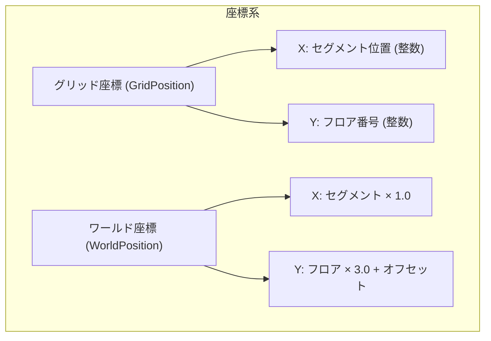

### 2.3 座標変換

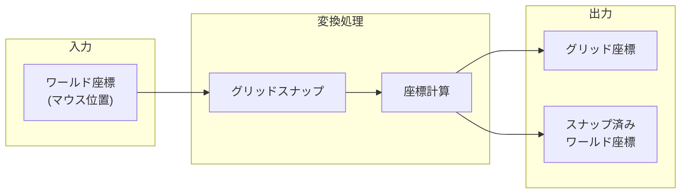

### 2.4 座標パラメータ

| パラメータ | 値 | 説明 |
|-----------|-----|------|
| `SEGMENT_SIZE` | 1.0f | 1セグメントのワールドサイズ |
| `FLOOR_HEIGHT` | 3.0f | 1フロアの高さ |
| `GROUND_LEVEL` | -3.0f | 地面のY座標 |
| `LOBBY_FLOOR` | 1 | ロビー階のフロア番号 |
| `GRID_ORIGIN_X` | 0 | グリッド原点のX座標 |

---

## 3. 建物サイズ定義

### 3.1 建物タイプとサイズ

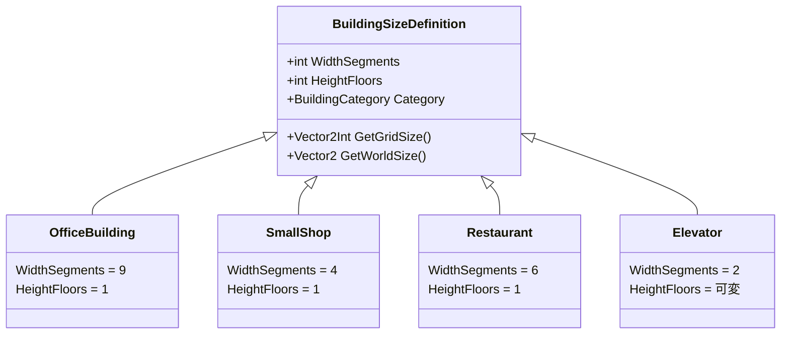

### 3.2 建物サイズテーブル

| 建物タイプ | 幅(セグメント) | 高さ(フロア) | ワールドサイズ |
|-----------|---------------|-------------|--------------|
| オフィス | 9 | 1 | 9 × 3 |
| 小型店舗 | 4 | 1 | 4 × 3 |
| レストラン | 6 | 1 | 6 × 3 |
| エレベーター | 2 | 可変 | 2 × (3×n) |
| ロビー | 可変 | 1 | 可変 × 3 |

### 3.3 視覚表現

```
オフィスビル（幅9セグメント × 高さ1フロア）:

┌─────────────────────────────────────┐
│  ■ ■ ■ ■ ■ ■ ■ ■ ■  (窓)           │  ← 高さ 3ユニット
│  ▒ ▒ ▒ ▒ ▒ ▒ ▒ ▒ ▒  (オフィス内部)  │
│  ═══════════════════  (床)          │
└─────────────────────────────────────┘
│←─────── 9セグメント (9ユニット) ────→│
```

---

## 4. フロア管理システム

### 4.1 フロア構造

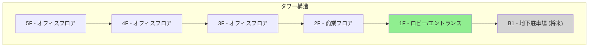

### 4.2 フロア番号とワールドY座標の関係

```
フロア番号 (Floor) → ワールドY座標 (World Y)

WorldY = GROUND_LEVEL + (Floor - LOBBY_FLOOR) × FLOOR_HEIGHT + FLOOR_HEIGHT / 2

例 (GROUND_LEVEL = -3.0, FLOOR_HEIGHT = 3.0, LOBBY_FLOOR = 1):
  1F: WorldY = -3.0 + (1-1) × 3.0 + 1.5 = -1.5 (中心)
  2F: WorldY = -3.0 + (2-1) × 3.0 + 1.5 =  1.5 (中心)
  3F: WorldY = -3.0 + (3-1) × 3.0 + 1.5 =  4.5 (中心)
```

### 4.3 FloorManager クラス設計

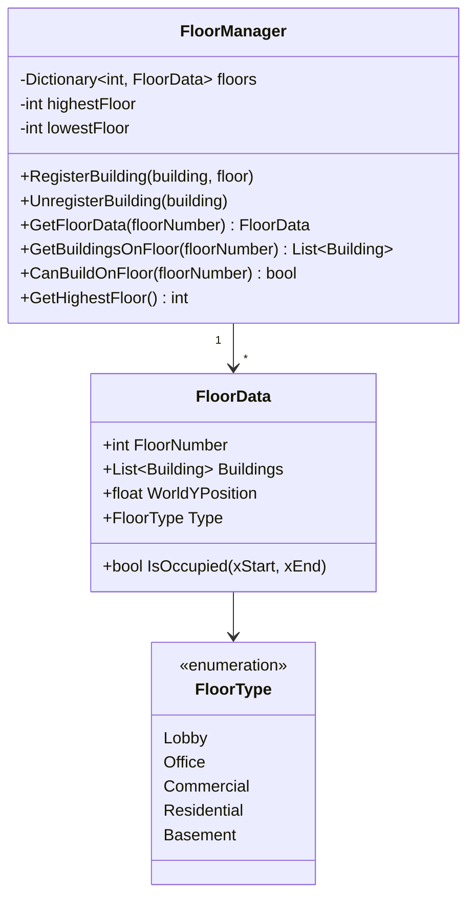

---

## 5. グリッドスナップシステム

### 5.1 スナップアルゴリズム

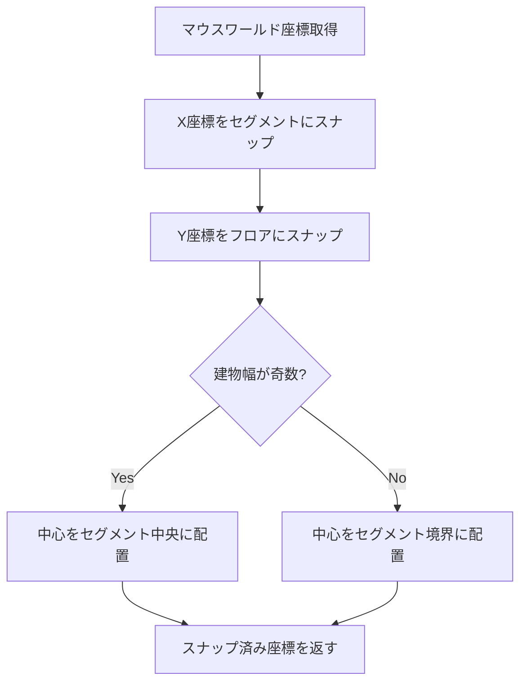

### 5.2 スナップ計算

```csharp
// X座標のスナップ（セグメント単位）
int snappedSegmentX = Mathf.RoundToInt(worldX / SEGMENT_SIZE);
float snappedWorldX = snappedSegmentX * SEGMENT_SIZE;

// 建物幅が奇数の場合、中心をセグメント中央に
if (buildingWidthSegments % 2 == 1) {
    snappedWorldX += SEGMENT_SIZE / 2f;
}

// Y座標のスナップ（フロア単位）
int targetFloor = Mathf.Max(1, Mathf.RoundToInt(
    (worldY - GROUND_LEVEL) / FLOOR_HEIGHT + LOBBY_FLOOR
));
float snappedWorldY = GROUND_LEVEL +
    (targetFloor - LOBBY_FLOOR) * FLOOR_HEIGHT +
    (FLOOR_HEIGHT / 2f);
```

### 5.3 グリッドビジュアライゼーション

```
グリッド表示イメージ:

Y(フロア)
│
│  ┌───┬───┬───┬───┬───┬───┬───┬───┬───┬───┐
4F │   │   │   │   │   │   │   │   │   │   │
│  ├───┼───┼───┼───┼───┼───┼───┼───┼───┼───┤
3F │   │   │   │   │   │   │   │   │   │   │
│  ├───┼───┼───┼───┼───┼───┼───┼───┼───┼───┤
2F │   │   │   │   │   │   │   │   │   │   │
│  ├───┼───┼───┼───┼───┼───┼───┼───┼───┼───┤
1F │   │   │   │   │   │   │   │   │   │   │
│  └───┴───┴───┴───┴───┴───┴───┴───┴───┴───┘
└─────────────────────────────────────────────→ X(セグメント)
   -5  -4  -3  -2  -1   0   1   2   3   4   5
```

---

## 6. 衝突検出システム

### 6.1 衝突検出フロー

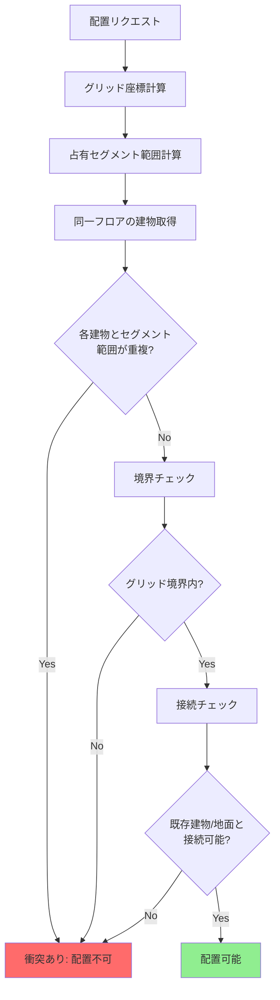

### 6.2 OccupancyGrid クラス設計

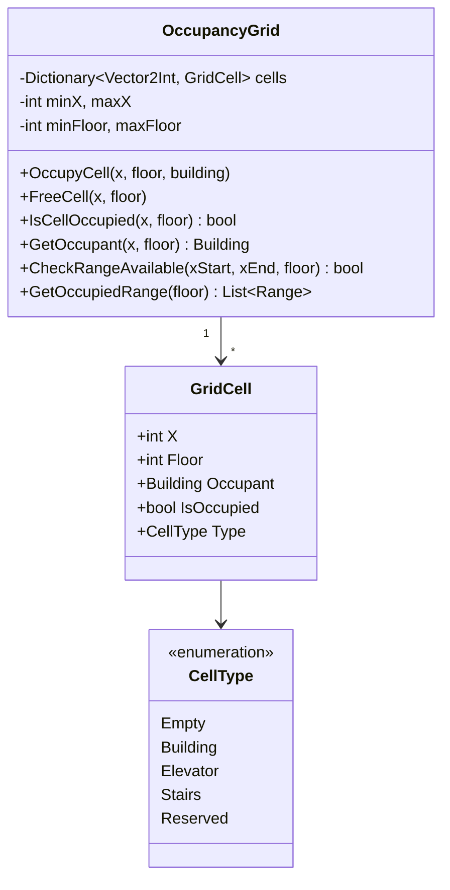

### 6.3 衝突検出アルゴリズム

```csharp
public bool CanPlaceBuilding(int centerX, int floor, int widthSegments) {
    int halfWidth = widthSegments / 2;
    int startX = centerX - halfWidth;
    int endX = startX + widthSegments - 1;

    // 1. 各セグメントの占有チェック
    for (int x = startX; x <= endX; x++) {
        if (IsCellOccupied(x, floor)) {
            return false;
        }
    }

    // 2. 境界チェック
    if (startX < minGridX || endX > maxGridX) {
        return false;
    }

    // 3. 接続性チェック（2F以上の場合）
    if (floor > 1) {
        // 下のフロアに支持構造が必要
        bool hasSupport = HasSupportBelow(startX, endX, floor);
        if (!hasSupport) {
            return false;
        }
    }

    return true;
}
```

---

## 7. クラス設計

### 7.1 全体アーキテクチャ

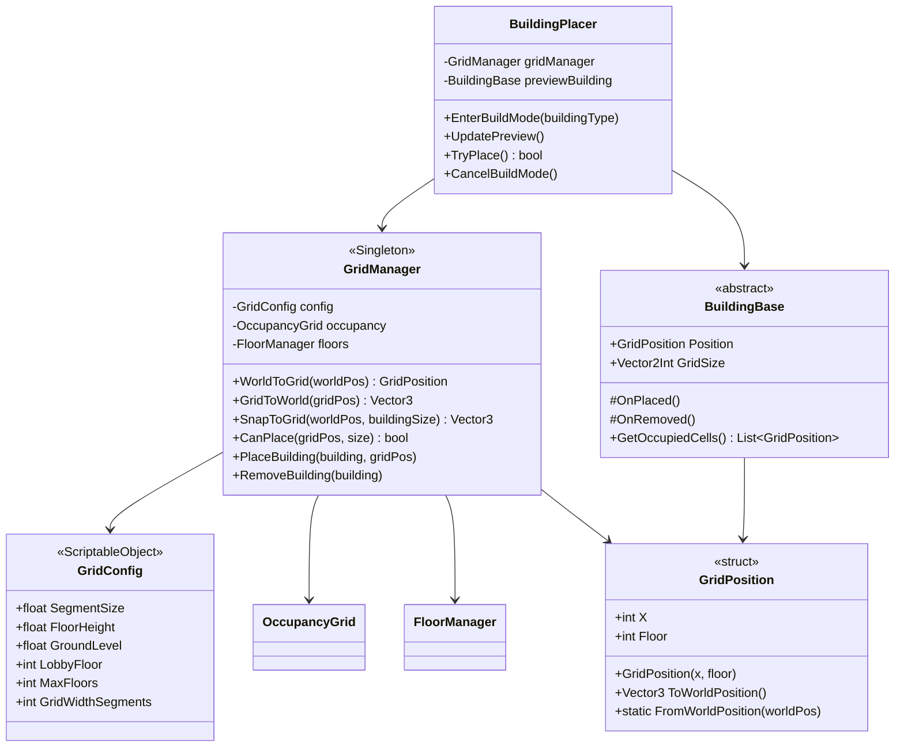

### 7.2 BuildingBase 抽象クラス

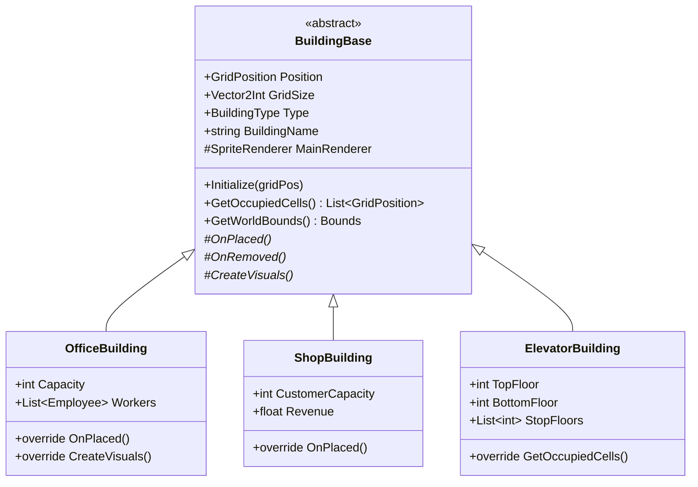

---

## 8. 配置フロー

### 8.1 建物配置シーケンス

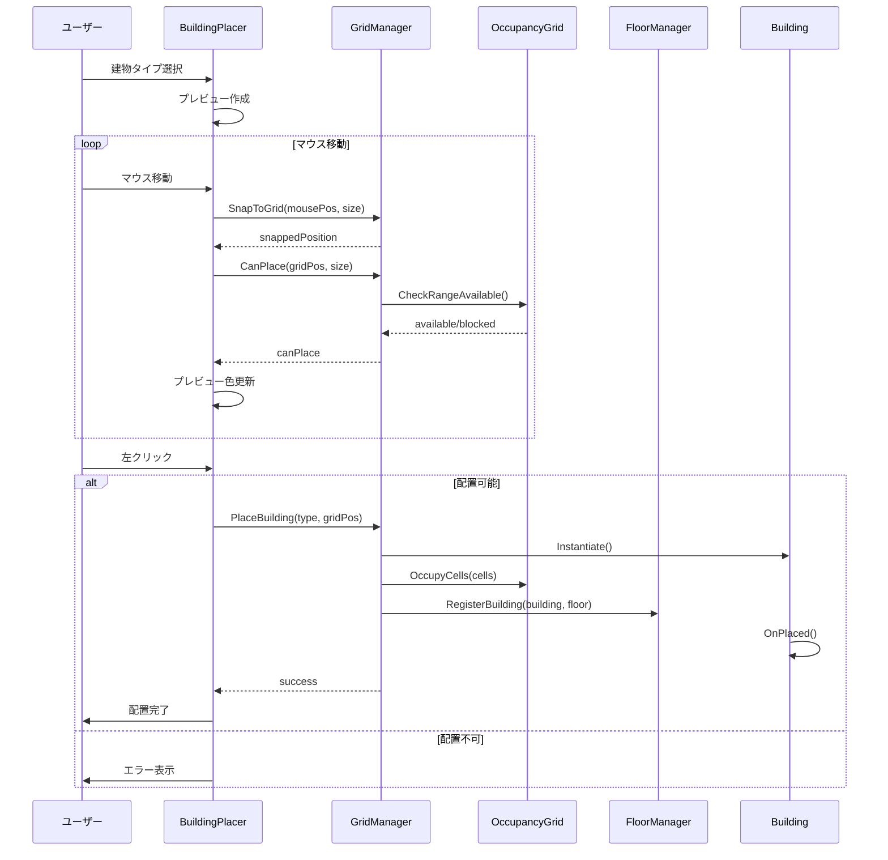

### 8.2 接続性検証

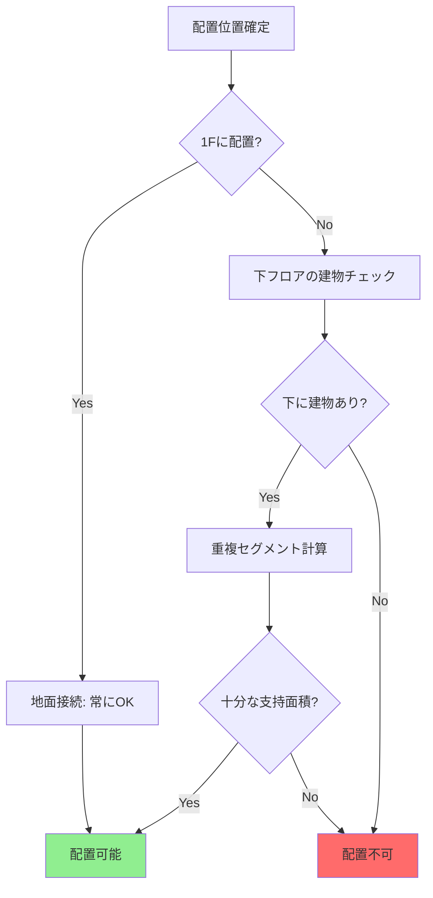

---

## 9. データ構造

### 9.1 GridPosition 構造体

```csharp
[System.Serializable]
public struct GridPosition : IEquatable<GridPosition>
{
    public int X;      // セグメント位置
    public int Floor;  // フロア番号

    public GridPosition(int x, int floor)
    {
        X = x;
        Floor = floor;
    }

    public Vector3 ToWorldPosition(GridConfig config)
    {
        float worldX = X * config.SegmentSize;
        float worldY = config.GroundLevel +
                       (Floor - config.LobbyFloor) * config.FloorHeight +
                       config.FloorHeight / 2f;
        return new Vector3(worldX, worldY, 0);
    }

    public static GridPosition FromWorldPosition(Vector3 worldPos, GridConfig config)
    {
        int x = Mathf.RoundToInt(worldPos.x / config.SegmentSize);
        int floor = Mathf.RoundToInt(
            (worldPos.y - config.GroundLevel) / config.FloorHeight
        ) + config.LobbyFloor;
        return new GridPosition(x, Mathf.Max(1, floor));
    }

    public bool Equals(GridPosition other) => X == other.X && Floor == other.Floor;
    public override int GetHashCode() => HashCode.Combine(X, Floor);
}
```

### 9.2 BuildingSizeDefinition

```csharp
[CreateAssetMenu(fileName = "BuildingSize", menuName = "TowerGame/BuildingSizeDefinition")]
public class BuildingSizeDefinition : ScriptableObject
{
    [Header("グリッドサイズ")]
    public int WidthSegments = 9;
    public int HeightFloors = 1;

    [Header("建物情報")]
    public BuildingType Type;
    public string DisplayName;
    public Sprite PreviewSprite;

    [Header("コスト")]
    public int BuildCost;
    public int MaintenanceCost;

    public Vector2Int GridSize => new Vector2Int(WidthSegments, HeightFloors);

    public Vector2 GetWorldSize(GridConfig config)
    {
        return new Vector2(
            WidthSegments * config.SegmentSize,
            HeightFloors * config.FloorHeight
        );
    }
}
```

---

## 10. 実装優先順位

### 10.1 フェーズ1: 基盤システム（必須）

```mermaid
gantt
    title フェーズ1: 基盤システム
    dateFormat X
    axisFormat %s

    section コア
    GridConfig ScriptableObject    :done, 1, 2
    GridPosition 構造体            :done, 2, 3
    GridManager シングルトン       :active, 3, 5

    section 占有管理
    OccupancyGrid 実装             :4, 6
    衝突検出アルゴリズム           :5, 7

    section 配置
    BuildingPlacer リファクタリング :6, 8
    グリッドスナップ実装            :7, 9
```

### 10.2 実装チェックリスト

#### Phase 1: コアシステム
- [ ] `GridConfig` ScriptableObject作成
- [ ] `GridPosition` 構造体実装
- [ ] `GridManager` シングルトン実装
- [ ] `OccupancyGrid` 実装
- [ ] 基本的なグリッドスナップ

#### Phase 2: 配置システム
- [ ] `BuildingPlacer` リファクタリング
- [ ] プレビュー表示のグリッド対応
- [ ] 衝突検出の実装
- [ ] 配置可否の視覚フィードバック

#### Phase 3: フロア管理
- [ ] `FloorManager` 実装
- [ ] `FloorData` 実装
- [ ] 複数フロア配置対応
- [ ] 接続性検証

#### Phase 4: 建物拡張
- [ ] `BuildingBase` 抽象クラス
- [ ] `OfficeBuilding` リファクタリング
- [ ] 新規建物タイプ追加準備

---

## 11. 設定値一覧

### 11.1 推奨デフォルト値

```csharp
// GridConfig 推奨デフォルト値
public static class GridDefaults
{
    public const float SEGMENT_SIZE = 1.0f;      // 1セグメント = 1ユニット
    public const float FLOOR_HEIGHT = 3.0f;      // 1フロア = 3ユニット
    public const float GROUND_LEVEL = -3.0f;     // 地面のY座標
    public const int LOBBY_FLOOR = 1;            // ロビー階 = 1F
    public const int MAX_FLOORS = 100;           // 最大階数
    public const int GRID_WIDTH_SEGMENTS = 100;  // グリッド幅（左右各50セグメント）
    public const int MIN_SEGMENT_X = -50;        // 最小X座標
    public const int MAX_SEGMENT_X = 50;         // 最大X座標
}
```

### 11.2 建物サイズ設定

```csharp
// 建物タイプごとのサイズ定義
public static class BuildingSizes
{
    // オフィス: 幅9セグメント × 高さ1フロア
    public static readonly Vector2Int OFFICE = new Vector2Int(9, 1);

    // 小型店舗: 幅4セグメント × 高さ1フロア
    public static readonly Vector2Int SMALL_SHOP = new Vector2Int(4, 1);

    // レストラン: 幅6セグメント × 高さ1フロア
    public static readonly Vector2Int RESTAURANT = new Vector2Int(6, 1);

    // エレベーター: 幅2セグメント × 高さ可変
    public static readonly Vector2Int ELEVATOR = new Vector2Int(2, 1);

    // 階段: 幅2セグメント × 高さ2フロア
    public static readonly Vector2Int STAIRS = new Vector2Int(2, 2);
}
```

---

## 12. 移行計画

### 12.1 既存コードからの移行

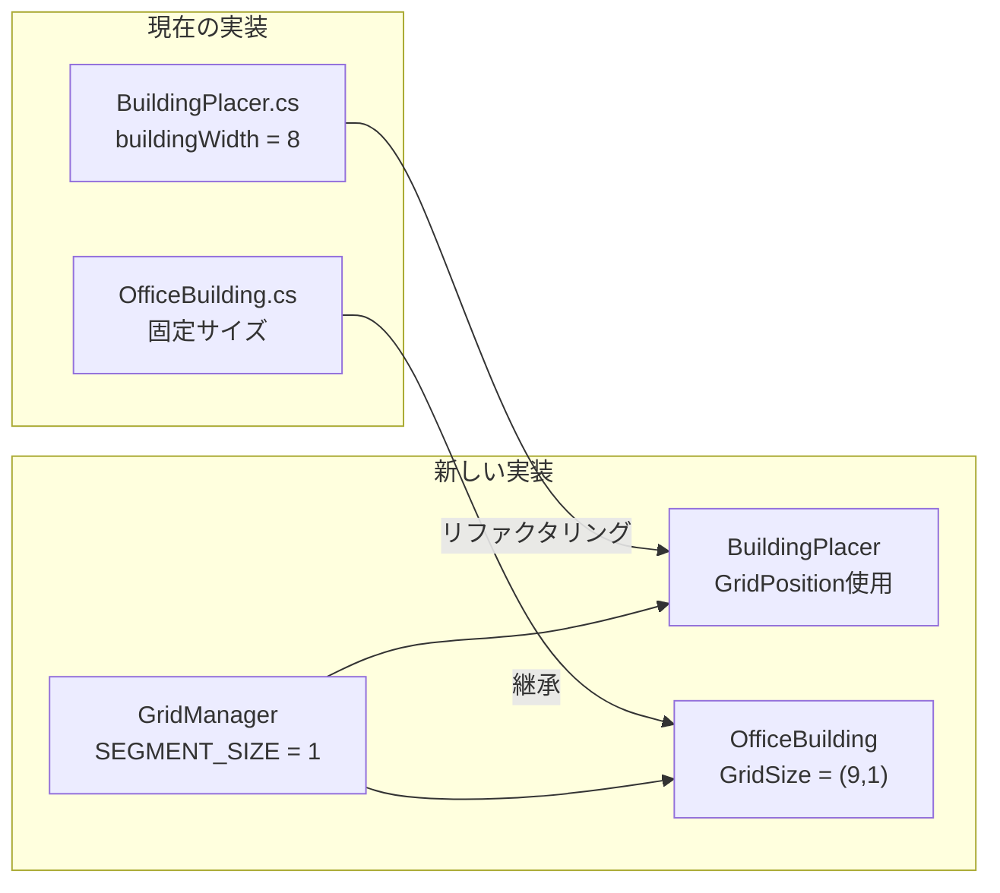

### 12.2 パラメータ変換

| 現在の実装 | 新しい実装 | 変換方法 |
|-----------|-----------|---------|
| `buildingWidth = 8` | `WidthSegments = 9` | +1セグメント |
| `buildingHeight = 5` | `HeightFloors = 1` | 1フロア化 |
| `groundLevel = -3` | `GROUND_LEVEL = -3` | そのまま |
| `minDistanceBetweenBuildings = 1` | グリッド占有で管理 | 廃止 |

---

## 13. テスト計画

### 13.1 ユニットテスト

```csharp
[Test]
public void GridPosition_ToWorldPosition_ReturnsCorrectPosition()
{
    var config = CreateTestConfig();
    var gridPos = new GridPosition(0, 1);  // 原点、1F

    Vector3 worldPos = gridPos.ToWorldPosition(config);

    Assert.AreEqual(0f, worldPos.x);
    Assert.AreEqual(-1.5f, worldPos.y);  // GROUND_LEVEL + FLOOR_HEIGHT/2
}

[Test]
public void OccupancyGrid_CanPlaceBuilding_DetectsCollision()
{
    var grid = new OccupancyGrid();
    grid.OccupyCells(new GridPosition(0, 1), new Vector2Int(9, 1));

    bool canPlace = grid.CanPlace(new GridPosition(4, 1), new Vector2Int(9, 1));

    Assert.IsFalse(canPlace);
}
```

### 13.2 統合テスト

```csharp
[Test]
public void BuildingPlacer_PlaceOffice_OccupiesCorrectCells()
{
    // Setup
    GridManager.Instance.Initialize();

    // Act
    var office = BuildingPlacer.Instance.PlaceBuilding(
        BuildingType.Office,
        new GridPosition(0, 1)
    );

    // Assert
    for (int x = -4; x <= 4; x++)
    {
        Assert.IsTrue(
            GridManager.Instance.IsCellOccupied(x, 1),
            $"Cell ({x}, 1) should be occupied"
        );
    }
}
```

---

## 14. 補足: The Tower II との比較

### 14.1 本設計とオリジナルの対応

| The Tower II | 本設計 | 備考 |
|-------------|--------|------|
| 1ピクセル = 1セグメント | 1ユニット = 1セグメント | Unity単位系に適合 |
| オフィス 9セグメント | `WidthSegments = 9` | 同等 |
| フロア高さ固定 | `FLOOR_HEIGHT = 3.0` | スケーラブル |
| ロビー必須 | 1F = ロビー | 同様の制約可能 |
| エレベーター必須 | 接続性検証で実装 | 将来対応 |

### 14.2 追加機能の余地

- 地下階対応（`Floor <= 0`）
- エスカレーター（隣接フロア接続）
- 駐車場（地下特殊フロア）
- テナント満足度システム

---

## 変更履歴

| 日付 | バージョン | 内容 |
|------|-----------|------|
| 2025-01-06 | 1.0 | 初版作成 |
